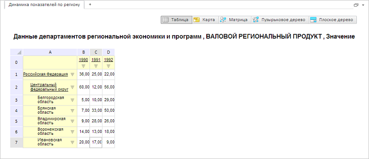

# GxTitle.setIsBold

GxTitle.setIsBold
-

# GxTitle.setIsBold

## Синтаксис

setIsBold(value: Boolean);

## Параметры

value. Устанавливаемое значение.
 Если для параметра установлено значение true,
 то тексту заголовка будет установлено полужирное начертание.

## Описание

Метод setIsBold устанавливает
 полужирное начертание тексту заголовка.

## Пример

Для выполнения примера необходимо наличие на html-странице компонента
 [ExpressBox](dhtmlExpress.chm::/Components/Express/ExpressBox/ExpressBox.htm)
 с наименованием «expressBox» (см. «[Пример
 создания компонента ExpressBox](dhtmlExpress.chm::/Components/Express/ExpressBox/ExpressBox_Example.htm)»). Для появления заголовка необходимо
 нажать на кнопку «Заголовок» на вкладке «Главная». Установим тексту заголовка
 полужирное начертание:

// Получаем заголовок
var title = expressBox.getDataView().getTitleView();
// Устанавливаем тексту заголовка полужирное начертание
title.setIsBold(true);
В результате тексту заголовка будет установлено полужирное начертание:

См. также:

[GxTitle](GxTitle.htm)

		Справочная
		 система на версию 10.9
		 от 18/08/2025,
		 © ООО «ФОРСАЙТ»,
