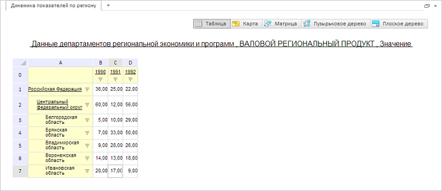

# GxTitle.setIsUnderline

GxTitle.setIsUnderline
-

# GxTitle.setIsUnderline

## Синтаксис

setIsUnderline(value: Boolean);

## Параметры

value. Устанавливаемое значение.
 Если для параметра установлено значение true,
 то тексту заголовка будет установлено подчеркивание.

## Описание

Метод setIsUnderline устанавливает
 подчеркивание тексту заголовка.

## Пример

Для выполнения примера необходимо наличие на html-странице компонента
 [ExpressBox](dhtmlExpress.chm::/Components/Express/ExpressBox/ExpressBox.htm)
 с наименованием «expressBox» (см. «[Пример
 создания компонента ExpressBox](dhtmlExpress.chm::/Components/Express/ExpressBox/ExpressBox_Example.htm)»). Для появления заголовка необходимо
 нажать на кнопку «Заголовок» на вкладке «Главная». Установим подчеркивание
 тексту заголовка:

// Получаем заголовок
var title = expressBox.getDataView().getTitleView();
// Подчеркиваем текст заголовка
title.setIsUnderline(true);
В результате текст заголовка будет подчеркнут:

См. также:

[GxTitle](GxTitle.htm)

		Справочная
		 система на версию 10.9
		 от 18/08/2025,
		 © ООО «ФОРСАЙТ»,
