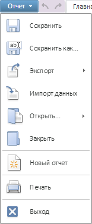

# MainMenu

MainMenu
-

# MainMenu

Пространство имен: PP.Mb.Ui;

## Иерархия наследования

[Object](dhtmlCommon.chm::/Classes/object/object.htm)

[Control](dhtmlUi.chm::/Classes/control/control.htm)

[DropPanel](dhtmlUi.chm::/Classes/droppanel/droppanel.htm)

[Menu](dhtmlUi.chm::/Classes/Menu/Menu.htm)

MainMenu

## Описание

Класс MainMenu реализует главное
 меню ленты инструментов.

## Комментарии

В веб-приложении главное меню содержит в себе экземпляры класса [PP.Ui.MenuItem](dhtmlUi.chm::/Classes/MenuItem/MenuItem.htm)
 и [PP.Ui.Separator](dhtmlUi.chm::/Classes/Separator/Separator.htm).

Главное меню может принимать следующий вид:

## Синтаксис

PP.initClass(PP.Mb.Ui.MainMenu, PP.Ui.[Menu](dhtmlUi.chm::/Classes/Menu/Menu.htm),
 "PP.Mb.Ui.MainMenu");"Menu");

## Конструктор

			 Имя конструктора
			 Краткое описание

			 
			 MainMenu
			 Конструктор MainMenu
			 создает экземпляр класса MainMenu.

## Свойства

		 Имя свойства
		 Краткое описание

		 
		 [SharepointEnabled](MainMenu.SharepointEnabled.htm)
		 Свойство SharepointEnabled
		 определяет доступность пункта меню «Обсудить в SharePoint».

		 
		 [ViewMode](MainMenu.ViewMode.htm)
		 Свойство ViewMode определяет
		 доступность пунктов меню.

## Методы

		 Имя метода
		 Краткое описание

		 
		 [getDiscussMenu](MainMenu.getDiscussMenu.htm)
		 Метод getDiscussMenu
		 возвращает экземпляр всплывающего меню «Поделиться».

		 
		 [getExportMenu](MainMenu.getExportMenu.htm)
		 Метод getExportMenu
		 возвращает экземпляр всплывающего меню «Экпорт».

## События

		 Имя события
		 Краткое описание

		 
		 [DiscussItemSelected](MainMenu.DiscussItemSelected.htm)
		 Событие DiscussItemSelected
		 наступает после выбора пункта меню «Обсудить».

		 
		 [ExportItemSelected](MainMenu.ExportItemSelected.htm)
		 Событие ExportItemSelected
		 наступает после выбора пункта меню «Экспорт».

		 
		 [ItemCreated](MainMenu.ItemCreated.htm)
		 Событие ItemCreated
		 наступает после создания пункта меню.

		 
		 [ItemCreating](MainMenu.ItemCreating.htm)
		 Событие ItemCreating
		 наступает перед созданием пункта меню.

## Свойства, унаследованные от класса [Menu](dhtmlUi.chm::/Classes/Menu/Menu.htm)

		 Имя свойства
		 Краткое описание

		 
		 [ImageList](dhtmlUi.chm::/classes/menu/menu.imagelist.htm)

		 Свойство ImageList
		 устанавливает [спрайт](dhtmlUi.chm::/components/imagelist/imagelist.htm)
		 для меню.

		 
		 [Items](dhtmlUi.chm::/classes/menu/menu.items.htm)
		 Свойство Items устанавливает
		 массив дочерних элементов меню.

		 
		 [ScrollHeight](dhtmlUi.chm::/Classes/Menu/Menu.ScrollHeight.htm)
		 Свойство ScrollHeight
		 определяет высоту прокручиваемого содержимого меню.

		 
		 [ShowIcons](dhtmlUi.chm::/classes/menu/menu.showicons.htm)
		 Свойство ShowIcons
		 определяет, отображается ли левая часть меню для пиктограмм.

## Методы, унаследованные от класса [Menu](dhtmlUi.chm::/Classes/Menu/Menu.htm)

		 Имя метода
		 Краткое описание

		 
		 [addItem](dhtmlUi.chm::/classes/menu/menu.additem.htm)

		 Метод addItem добавляет
		 дочерний элемент в [меню](dhtmlUi.chm::/components/menu/menu.htm).

		 
		 [clearCheckedByGroupName](dhtmlUi.chm::/Classes/Menu/Menu.clearCheckedByGroupName.htm)
		 Метод clearCheckedByGroupName
		 сбрасывает отметку с элементов меню по имени группы.

		 
		 [clearItems](dhtmlUi.chm::/classes/menu/menu.clearitems.htm)
		 Метод clearItems удаляет
		 дочерние элементы меню.

		 
		 [getMenuItemById](dhtmlUi.chm::/classes/menu/menu.getmenuitembyid.htm)
		 Метод getMenuItemById
		 возвращает дочерний элемент меню по его идентификатору.

		 
		 [insertItem](dhtmlUi.chm::/classes/menu/menu.insertitem.htm)
		 Метод insertItem вставляет
		 пункт меню в указанную позицию.

		 
		 [insertItemAfter](dhtmlUi.chm::/Classes/Menu/Menu.insertItemAfter.htm)
		 Метод insertItemAfter
		 вставляет пункт в меню после указанного пункта.

		 
		 [insertItemBefore](dhtmlUi.chm::/Classes/Menu/Menu.insertItemBefore.htm)
		 Метод insertItemBefore
		 вставляет пункт в меню перед указанным пунктом.

		 
		 [removeItem](dhtmlUi.chm::/Classes/Menu/Menu.removeItem.htm)
		 Метод removeItem удаляет
		 элемент меню.

		 
		 [removeItemByIndex](dhtmlUi.chm::/classes/menu/menu.removeitembyindex.htm)
		 Метод removeItemByIndex
		 удаляет элемент меню по его индексу.

		 
		 [showContext](dhtmlUi.chm::/Classes/Menu/Menu.showContext.htm)
		 Метод showContext отображает
		 меню как контекстное.

## События, унаследованные от класса [Menu](dhtmlUi.chm::/Classes/Menu/Menu.htm)

		 Имя события
		 Краткое описание

		 
		 [ItemSelected](dhtmlUi.chm::/classes/menu/menu.itemselected.htm)
		 Событие ItemSelected наступает
		 при выборе элемента меню.

## Свойства, унаследованные от класса [DropPanel](dhtmlUi.chm::/Classes/droppanel/droppanel.htm)

		 Имя свойства
		 Краткое описание

		 
		 [EnableResize](dhtmlUi.chm::/classes\droppanel\droppanel.enableresize.htm)

		 Свойство EnableResize
		 определяет возможность изменять размеры компонента.

		 
		 [EnableResizeBottom](dhtmlUi.chm::/classes\droppanel\droppanel.enableresizebottom.htm)

		 Свойство EnableResizeBottom
		 определяет возможность изменения высоты компонента с помощью захвата
		 и перетаскивания его нижней границы курсором мыши.

		 
		 [EnableResizeLeft](dhtmlUi.chm::/classes\droppanel\droppanel.enableresizeleft.htm)

		 Свойство EnableResizeLeft
		 определяет возможность изменения ширины компонента с помощью захвата
		 и перетаскивания его левой границы курсором мыши.

		 
		 [EnableResizeRight](dhtmlUi.chm::/classes\droppanel\droppanel.enableresizeright.htm)

		 Свойство EnableResizeRight
		 определяет возможность изменения ширины компонента с помощью захвата
		 и перетаскивания его правой границы курсором мыши.

		 
		 [EnableResizeTop](dhtmlUi.chm::/classes\droppanel\droppanel.enableresizetop.htm)

		 Свойство EnableResizeTop определяет
		 возможность изменения высоты компонента с помощью захвата и перетаскивания
		 его верхней границы курсором мыши.

		 
		 [EnableRestoreFocus](dhtmlUi.chm::/Classes/DropPanel/DropPanel.EnableRestoreFocus.htm)

		 Свойство EnableRestoreFocus
		 определяет возможность восстановления фокуса при закрытии панели.

		 
		 [MaxDropDownHeight](dhtmlUi.chm::/classes\droppanel\droppanel.maxdropdownheight.htm)

		 Свойство MaxDropDownHeight
		 определяет максимальную высоту раскрывающейся панели.

		 
		 [MaxDropDownWidth](dhtmlUi.chm::/classes\droppanel\droppanel.maxdropdownwidth.htm)

		 Свойство MaxDropDownWidth
		 определяет максимальную ширину раскрывающейся панели.

		 
		 [MinDropDownHeight](dhtmlUi.chm::/classes\droppanel\droppanel.mindropdownheight.htm)

		 Свойство MinDropDownHeight
		 определяет минимальную высоту раскрывающейся панели.

		 
		 [MinDropDownWidth](dhtmlUi.chm::/classes\droppanel\droppanel.mindropdownwidth.htm)

		 Свойство MinDropDownWidth
		 определяет минимальную ширину раскрывающейся панели.

## Методы, унаследованные от класса [DropPanel](dhtmlUi.chm::/Classes/droppanel/droppanel.htm)

		 Имя метода
		 Краткое описание

		 
		 [getDroppedDown](dhtmlUi.chm::/classes\droppanel\droppanel.getdroppeddown.htm)

		 Метод getDroppedDown
		 возвращает признак того, раскрыта ли панель.

		 
		 [isVisibleArea](dhtmlUi.chm::/classes\droppanel\droppanel.isvisiblearea.htm)

		 Метод isVisibleArea
		 определяет, входит ли раскрывающая часть в видимую область.

		 
		 [setPosition](dhtmlUi.chm::/classes\droppanel\droppanel.setposition.htm)

		 Метод setPosition устанавливает
		 позицию раскрывающейся панели.

		 
		 [show](dhtmlUi.chm::/classes/droppanel/droppanel.show.htm)

		 Метод show раскрывает
		 панель.

## События, унаследованные от класса [DropPanel](dhtmlUi.chm::/Classes/droppanel/droppanel.htm)

		 Имя события
		 Краткое описание

		 
		 [Closed](dhtmlUi.chm::/classes\droppanel\droppanel.closed.htm)

		 Событие Closed наступает
		 после закрытия компонента.

		 
		 [FrameDown](dhtmlUi.chm::/classes\droppanel\droppanel.framedown.htm)

		 Событие FrameDown
		 наступает по щелчку мыши за пределами панели.

		 
		 [Opened](dhtmlUi.chm::/classes\droppanel\droppanel.opened.htm)

		 Событие Opened наступает
		 сразу после открытия компонента.

		 
		 [Opening](dhtmlUi.chm::/classes\droppanel\droppanel.opening.htm)

		 Событие Opening наступает
		 перед открытием компонента.

		 
		 [OutOfPanelDown](dhtmlUi.chm::/classes\droppanel\droppanel.outofpaneldown.htm)

		 Событие OutOfPanelDown
		 наступает по щелчку мыши за пределами панели в случае отображения без
		 фрейма-подложки.

		 
		 [SizeChanged](dhtmlUi.chm::/classes\droppanel\droppanel.sizechanged.htm)

		 Событие SizeChanged
		 наступает после того, как были изменены размеры компонента.

		 
		 [SizeChanging](dhtmlUi.chm::/classes\droppanel\droppanel.sizechanging.htm)

		 Событие SizeChanging
		 наступает перед изменением размеров компонента.

## Свойства, унаследованные от класса [Control](dhtmlUi.chm::/Classes/control/control.htm)

		 Имя свойства
		 Краткое описание

		 
		 [Anchors](dhtmlUi.chm::/Classes/Control/Control.Anchors.htm)
		 Свойство Anchors определяет
		 позицию компонента, размещенного внутри контейнера.

		 
		 [Animation](dhtmlUi.chm::/Classes/Control/Control.Animation.htm)
		 Свойство Animation
		 определяет параметры анимации для компонента.

		 
		 [Bottom](dhtmlUi.chm::/Classes/Control/Control.Bottom.htm)
		 Свойство Bottom определяет
		 отступ снизу при размещении компонента внутри LayoutPanel.

		 
		 [Content](dhtmlUi.chm::/classes\control\control.content.htm)
		 Свойство Content определяет
		 содержимое компонента.

		 
		 [ContextMenu](dhtmlUi.chm::/Classes\Control\Control.ContextMenu.htm)
		 Свойство ContextMenu
		 определяет контекстное меню для компонента.

		 
		 [Data](dhtmlUi.chm::/Classes/Control/Control.Data.htm)
		 Свойство Data предназначено
		 для хранения любых пользовательских данных.

		 
		 [Enabled](dhtmlUi.chm::/classes\control\control.enabled.htm)
		 Свойство Enabled определяет
		 признак доступности компонента для использования.

		 
		 [Height](dhtmlUi.chm::/classes\control\control.height.htm)
		 Свойство Height определяет
		 высоту компонента.

		 
		 [IsRTL](dhtmlUi.chm::/classes\control\control.isrtl.htm)
		 Свойство IsRTL определяет
		 признак расположения элементов компонента по правому краю.

		 
		 [IsVisible](dhtmlUi.chm::/Classes/Control/Control.IsVisible.htm)
		 Свойство IsVisible
		 определяет признак отображения компонента.

		 
		 [Left](dhtmlUi.chm::/Classes/Control/Control.Left.htm)
		 Свойство Left определяет
		 отступ слева при размещении компонента внутри [GridPanel](dhtmlUi.chm::/Components/GridPanel/GridPanel.htm).

		 
		 [Opacity](dhtmlUi.chm::/Classes/Control/Control.Opacity.htm)
		 Свойство Opacity определяет
		 прозрачность компонента.

		 
		 [Parent](dhtmlUi.chm::/Classes/Control/Control.Parent.htm)
		 Свойство Parent определяет
		 родительский компонент элемента управления.

		 
		 [ParentNode](dhtmlUi.chm::/Classes/Control/Control.ParentNode.htm)
		 Свойство ParentNode
		 определяет родительскую DOM-вершину.

		 
		 [ResourceKey](dhtmlUi.chm::/classes\control\control.resourcekey.htm)
		 Свойство ResourceKey
		 определяет ресурсный ключ для компонента.

		 
		 [Right](dhtmlUi.chm::/Classes/Control/Control.Right.htm)
		 Свойство Right определяет
		 отступ справа при размещении компонента внутри LayoutPanel.

		 
		 [Rotate](dhtmlUi.chm::/Classes/Control/Control.Rotate.htm)
		 Свойство Rotate определяет
		 угол поворота компонента.

		 
		 [ShowToolTip](dhtmlUi.chm::/Classes/Control/Control.ShowToolTip.htm)
		 Свойство ShowToolTip
		 определяет признак возможности отображения [всплывающей
		 подсказки](dhtmlUi.chm::/Classes/Control/Control.ToolTip.htm) компонента.

		 
		 [Style](dhtmlUi.chm::/Classes/Control/Control.Style.htm)
		 Свойство Style определяет
		 стиль для компонента.

		 
		 [TabIndex](dhtmlUi.chm::/classes\control\control.tabindex.htm)
		 Свойство TabIndex определяет
		 последовательность перехода элемента управления внутри контейнера.

		 
		 [Tag](dhtmlUi.chm::/Classes/Control/Control.Tag.htm)
		 Свойство Tag определяет
		 JSON-объект, ассоциированный с компонентом.

		 
		 [ToolTip](dhtmlUi.chm::/classes\control\control.tooltip.htm)
		 Свойство ToolTip определяет
		 текст всплывающей подсказки компонента.

		 
		 [Top](dhtmlUi.chm::/Classes/Control/Control.Top.htm)
		 Свойство Top определяет
		 отступ сверху при размещении компонента внутри [GridPanel](dhtmlUi.chm::/Components/GridPanel/GridPanel.htm).

		 
		 [Value](dhtmlUi.chm::/classes\control\control.value.htm)
		 Свойство Value определяет
		 значение компонента.

		 
		 [Width](dhtmlUi.chm::/classes\control\control.width.htm)
		 Свойство Width определяет
		 ширину компонента.

## Методы, унаследованные от класса [Control](dhtmlUi.chm::/Classes/control/control.htm)

		 Имя метода
		 Краткое описание

		 
		 [addClass](dhtmlUi.chm::/classes\control\control.addclass.htm)

		 Метод addClass добавляет
		 CSS-класс к компоненту.

		 
		 [addEventHandler](dhtmlUi.chm::/Classes/Control/Control.addEventHandler.htm)
		 Метод addEventHandler
		 добавляет обработчик события на DOM-вершину.

		 
		 [addStateClass](dhtmlUi.chm::/Classes/Control/Control.addStateClass.htm)

		 Метод addStateClass
		 добавляет CSS-класс к компоненту и удаляет прежний CSS-класс.

		 
		 [addToNode](dhtmlUi.chm::/classes\control\control.addtonode.htm)

		 Метод addToNode добавляет
		 компонент в указанную вершину.

		 
		 [bindEvents](dhtmlUi.chm::/Classes/Control/Control.bindEvents.htm)
		 Метод bindEvents подписывает
		 элемент на все стандартные события.

		 
		 [getAnchorFlags](dhtmlUi.chm::/Classes/Control/Control.getAnchorFlags.htm)

		 Метод getAnchorFlags
		 возвращает JSON-объект с настройками текущей позиции компонента.

		 
		 [getClass](dhtmlUi.chm::/classes\control\control.getclass.htm)

		 Метод getClass возвращает
		 текущие css-классы компонента.

		 
		 [getCssStyle](dhtmlUi.chm::/Classes/Control/Control.getCssStyle.htm)

		 Метод getCssStyle возвращает
		 стили для указанной вершины.

		 
		 [getDomNode](dhtmlUi.chm::/Classes/Control/Control.getDomNode.htm)

		 Метод getDomNode возвращает
		 главную DOM-вершину компонента.

		 
		 [getFocused](dhtmlUi.chm::/Classes/Control/Control.getFocused.htm)

		 Метод getFocused определяет
		 наличие фокуса у компонента.

		 
		 [getIsBinded](dhtmlUi.chm::/Classes/Control/Control.getIsBinded.htm)
		 Метод getIsBinded возвращает
		 признак подписи элемента на события DOM-вершины.

		 
		 [hide](dhtmlUi.chm::/classes\control\control.hide.htm)

		 Метод hide скрывает
		 элемент управления.

		 
		 [hideToolTip](dhtmlUi.chm::/Classes/Control/Control.hideToolTip.htm)

		 Метод hideToolTip очищает
		 таймаут появления подсказки и скрывает её, если она был показана.

		 
		 [refreshStyle](dhtmlUi.chm::/Classes/Control/Control.refreshStyle.htm)
		 Метод refreshStyle
		 обновляет CSS-стили элемента.

		 
		 [removeClass](dhtmlUi.chm::/classes\control\control.removeclass.htm)

		 Метод removeClass удаляет
		 CSS-класс из компонента.

		 
		 [removeEventHandler](dhtmlUi.chm::/Classes/Control/Control.removeEventHandler.htm)
		 Метод removeEventHandler
		 удаляет обработчик события DOM-вершины.

		 
		 [removeFromDOM](dhtmlUi.chm::/classes/control/control.removefromdom.htm)
		 Метод removeFromDOM
		 удаляет вершину из DOM-структуры.

		 
		 [removeStateClasses](dhtmlUi.chm::/Classes/Control/Control.removeStateClasses.htm)

		 Метод removeStateClasses
		 удаляет CSS-классы компонента.

		 
		 [setDraggable](dhtmlUi.chm::/classes\control\control.setdraggable.htm)

		 Метод setDraggable
		 устанавливает возможность перетаскивания компонента на HTML-странице.

		 
		 [setFocus](dhtmlUi.chm::/Classes/Control/Control.setFocus.htm)

		 Метод setFocus устанавливает
		 фокус компонента.

		 
		 [setIsHovered](dhtmlUi.chm::/Classes/Control/Control.setIsHovered.htm)

		 Метод setIsHovered
		 настраивает отображение компонента только при наведении на него
		 курсора.

		 
		 [setSize](dhtmlUi.chm::/classes\control\control.setsize.htm)

		 Метод setSize устанавливает
		 размеры компонента.

		 
		 [show](dhtmlUi.chm::/classes/control/control.show.htm)

		 Метод show отображает
		 элемент управления.

		 
		 [unBindEvents](dhtmlUi.chm::/Classes/Control/Control.unBindEvents.htm)
		 Метод unBindEvents
		 отписывает элемент от всех стандартных событий.

		 
		 [updatePosition](dhtmlUi.chm::/Classes/Control/Control.updatePosition.htm)

		 Метод updatePosition
		 корректирует размер и положение при абсолютном позиционировании
		 на основе текущих параметров.

		 
		 [updateSize](dhtmlUi.chm::/classes\control\control.updatesize.htm)

		 Метод updateSize обновляет
		 размеры компонента подгонке размеров контейнера, в котором находится
		 компонент.

## События, унаследованные от класса [Control](dhtmlUi.chm::/Classes/control/control.htm)

		 Имя события
		 Краткое описание

		 
		 [Drag](dhtmlUi.chm::/classes\control\control.drag.htm)
		 Событие Drag наступает
		 при нажатии и удерживании кнопки мыши.

		 
		 [DragEnd](dhtmlUi.chm::/classes\control\control.dragend.htm)
		 Событие DragEnd наступает
		 при окончании перетаскивания компонента.

		 
		 [DragStart](dhtmlUi.chm::/classes\control\control.dragstart.htm)
		 Событие DragStart наступает,
		 когда начинается перетаскивание компонента.

		 
		 [OnContextMenu](dhtmlUi.chm::/classes\control\control.OnContextMenu.htm)
		 Событие OnContextMenu
		 наступает при вызове контекстного меню компонента.

		 
		 [SizeChanged](dhtmlUi.chm::/Classes/Control/Control.SizeChanged.htm)
		 Событие SizeChanged
		 наступает после изменения размеров компонента.

		 
		 [SizeChanging](dhtmlUi.chm::/Classes/Control/Control.SizeChanging.htm)
		 Событие SizeChanging
		 наступает во время изменения размеров компонента.

## Свойства, унаследованные от класса [Object](dhtmlCommon.chm::/Classes/object/object.htm)

		 Имя свойства
		 Краткое описание

		 
		 [Id](dhtmlCommon.chm::/classes\object\object.id.htm)

		 Свойство Id определяет
		 идентификатор объекта репозитория.

## Методы, унаследованные от класса [Object](dhtmlCommon.chm::/Classes/object/object.htm)

		 Имя метода
		 Краткое описание

		 
		 [clone](dhtmlCommon.chm::/classes\object\object.clone.htm)
		 Метод clone создает
		 копию объекта.

		 
		 [dispose](dhtmlCommon.chm::/classes\object\object.dispose.htm)
		 Метод dispose уничтожает
		 компонент.

		 
		 [getHashCode](dhtmlCommon.chm::/Classes/Object/Object.getHashCode.htm)
		 Метод getHashCode возвращает
		 хеш-код объекта репозитория.

		 
		 [getId](dhtmlCommon.chm::/Classes/Object/Object.Id.htm)
		 Метод getId возвращает
		 идентификатор объекта репозитория.

		 
		 [getSettings](dhtmlCommon.chm::/Classes/Object/Object.getSettings.htm)
		 Метод getSettings возвращает
		 настройки объекта репозитория.

		 
		 [getTypeName](dhtmlCommon.chm::/classes\object\object.gettypename.htm)
		 Метод getTypeName возвращает
		 имя типа объекта без пространства имен, к которому он принадлежит.

		 
		 [isEqual](dhtmlCommon.chm::/Classes/Object/Object.isEqual.htm)
		 Метод isEqual определяет,
		 равен ли заданный объект текущему объекту репозитория.

		 
		 [isLive](dhtmlCommon.chm::/Classes/Object/Object.isLive.htm)
		 Метод isLive определяет
		 действительность объекта репозитория.

		 
		 [removeAllEvents](dhtmlCommon.chm::/Classes/Object/Object.removeAllEvents.htm)
		 Метод removeAllEvents
		 удаляет все обработчики событий объекта по заданному контексту.

		 
		 [setId](dhtmlCommon.chm::/Classes/Object/Object.Id.htm)
		 Метод setId определяет
		 идентификатор объекта репозитория.

		 
		 [setSettings](dhtmlCommon.chm::/Classes/Object/Object.setSettings.htm)
		 Метод setSettings задает
		 настройки объекта репозитория.

		 
		 [defineProps](dhtmlCommon.chm::/Classes/Object/Object.defineProps.htm)
		 Метод defineProps создает
		 методы get и set из массива имен для указанного класса.

		 
		 [keys](dhtmlCommon.chm::/Classes/Object/Object.keys.htm)
		 Метод keys возвращает
		 массив названий методов и свойств для указанного объекта.

См. также:

[PP.Mb.Ui](../../PP.Mb.Ui.htm)

		Справочная
		 система на версию 10.9
		 от 18/08/2025,
		 © ООО «ФОРСАЙТ»,
