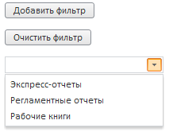
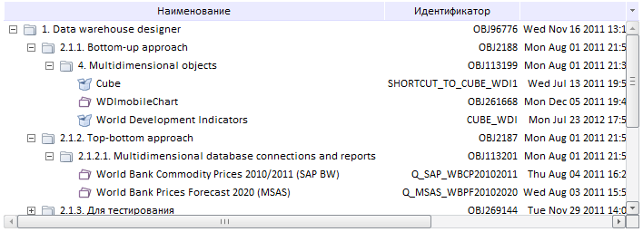
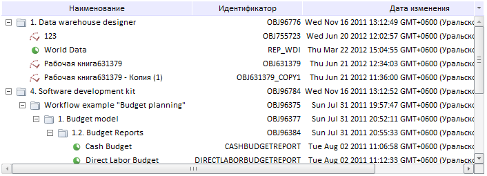

# MetabaseTreeList.addFilter

MetabaseTreeList.addFilter
-

# MetabaseTreeList.addFilter

## Синтаксис

addFilter(arrMetabaseObjectClasses, notRefresh)

## Параметры

arrMetabaseObjectClasses. Список
 объектов, которые будут отображаться в дереве. Элемент или массив элементов
 перечисления PP.Mb.[MetabaseObjectClass](KeSom.chm::/Enums/MetabaseObjectClass.htm);

notRefresh. Определяет,
 будет ли обновляться дерево. Если значение не задано, дерево будет обновляться
 автоматически после добавления нового фильтра. Чтобы дерево не обновлялось,
 установите значение true.

## Описание

Метод addFilter добавляет список
 типов объектов, которые будут отображаться в дереве.

## Комментарии

Очистить список типов объектов, которые будут отображаться в дереве,
 можно при помощи метода [MetabaseTreeList.clearFilter](MetabaseTreeList.clearFilter.htm).

## Пример

Для выполнения примера предполагается наличие на html-странице компонента
 [MetabaseTreeList](../../../Components/Metabase/MetabaseTreeList/MetabaseTreeList.htm)
 с наименованием «list1» (см. «[Пример
 создания компонента MetabaseTreeList](../../../Components/Metabase/MetabaseTreeList/MetabaseTreeList_Example.htm)»). Создадим кнопку с наименованием
 «but1», при нажатии на которую будет добавляться тип объектов, отображающихся
 в дереве, кнопку «but2», при нажатии на которую будет очищен фильтр, то
 есть в дерево будут попадать объекты всех типов, и раскрывающийся список
 с наименованием «combo1», содержащий типы объектов репозитория. В свойстве
 [Id](dhtmlCommon.chm::/Classes/Object/Object.Id.htm)
 каждого элемента списка - элемент перечисления PP.Mb.[MetabaseObjectClass](KeSom.chm::/Enums/MetabaseObjectClass.htm):

        //кнопка для добавления в список типа объектов, которые будут отображаться в дереве
        var but1 = new PP.Ui.Button(
        {
            ParentNode: document.getElementById("div1"),
            Content: "Добавить фильтр"
        })
        //кнопка для очистки фильтра: в дереве будут отображаться объекты всех типов
        var but2 = new PP.Ui.Button(
        {
            ParentNode: document.getElementById("div3"),
            Content: "Очистить фильтр"
        })
        //раскрывающийся список для выбора типа объектов
        var combo1 = new PP.Ui.ComboBox(
        {

            ParentNode: document.getElementById("div2"),
            ListBox: {
                Items: [
                {
                    Content: "Экспресс-отчеты",
                    Id: "2561"
                },
                {
                    Content: "Регламентные отчеты",
                    Id: "2562"
                },
                {
                    Content: "Рабочие книги",
                    Id: "2827"
                }]

            },
            Width: 200
        })
        //при нажатии на кнопку в список типов отображаемых объектов добавится тип, выбранный из раскрывающегося списка combo1
        but1.Click.add(function (sender, args)
        {
            list1.addFilter(combo1.getListBox().getSelectedItem().getId());
        })
        //при нажатии на кнопку в дереве будут отображаться объекты всех типов
        but2.Click.add(function (sender, args)
        {
            list1.clearFilter();
        })

В теге BODY добавьте следующие элементы:

<body
 onload="onLoad();">

     

    

     

    

     

    

 </body>

После выполнения примера на html-страницу будут добавлены следующие
 компоненты:

Выберите один из элементов раскрывающегося списка, нажмите кнопку «Добавить
 фильтр» - в дереве будут отображаться объекты выбранного типа. Например,
 выберите пункт «Экспресс-отчеты» и нажмите кнопку «Добавить фильтр». В
 дереве будут отображаться объекты двух типов: стандартный куб (данный
 фильтр установлен в [примере
 создания компонента MetabaseTreeList](../../../Components/Metabase/MetabaseTreeList/MetabaseTreeList_Example.htm)) и экспресс-отчет:

Нажмите кнопку «Очистить фильтр», выберите из раскрывающегося списка
 пункт «Регламентные отчеты», нажмите кнопку «Добавить фильтр», затем выберите
 пункт «Рабочие книги» и нажмите кнопку «Добавить фильтр». В дереве будут
 отображаться только регламентные отчеты и рабочие книги:

См. также:

[MetabaseTreeList](MetabaseTreeList.htm)

		Справочная
		 система на версию 10.9
		 от 18/08/2025,
		 © ООО «ФОРСАЙТ»,
