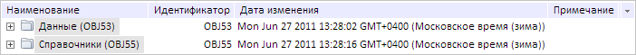
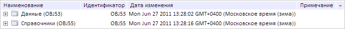

# MetabaseTreeList.clearSelection

MetabaseTreeList.clearSelection
-

# MetabaseTreeList.clearSelection

## Синтаксис

clearSelection();

## Описание

Метод clearSelection снимает
 выделение со всех вершин дерева.

## Пример

Для выполнения примера предполагается наличие на html-странице компонента
 [MetabaseTreeList](../../../Components/Metabase/MetabaseTreeList/MetabaseTreeList.htm) с наименованием
 «list1» (см. «[Пример
 создания компонента MetabaseTreeList](../../../Components/Metabase/MetabaseTreeList/MetabaseTreeList_Example.htm)»). Выделим все вершины дерева:

list1.selectAll();
В результате выполнения примера были выделены все вершины дерева:

Далее снимем выделение со всех вершин:

list1.clearSelection();
После выполнения примера выделение со всех вершин было снято:

См. также:

[DataSource](dhtmlGraphicBase.chm::/Classes/PP/DataSource/DataSource.htm)

		Справочная
		 система на версию 10.9
		 от 18/08/2025,
		 © ООО «ФОРСАЙТ»,
