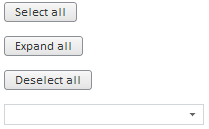
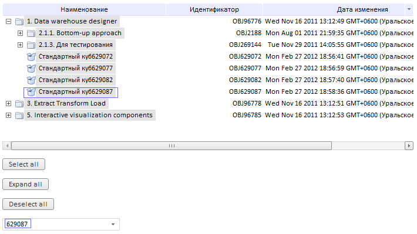

# MetabaseTreeList.expandNodesTo

MetabaseTreeList.expandNodesTo
-

# MetabaseTreeList.expandNodesTo

## Синтаксис

expandNodesTo(key);

## Параметры

key. Ключ объекта, до которого
 нужно развернуть все вершины.

## Описание

Метод expandNodesTo разворачивает
 все папки, в которых содержится объект с указанным ключом.

## Пример

Для выполнения примера предполагается наличие на html-странице компонента
 [MetabaseTreeList](../../../Components/Metabase/MetabaseTreeList/MetabaseTreeList.htm)
 с наименованием «list1» (см. «[Пример
 создания компонента MetabaseTreeList](../../../Components/Metabase/MetabaseTreeList/MetabaseTreeList_Example.htm)»). Добавим следующие элементы
 управления:

	- кнопку «but1», при нажатии на которую будут выделяться все вершины
	 дерева и ключи выделенных вершин будут добавляться в раскрвающийся
	 список «combo1»;

	- кнопку «but2», при нажатии на которую будут разворачиваться
	 все вершины дерева;

	- кнопку «but3», при нажатии на которую будет снята отметка со
	 всех вершин дерева;

	- раскрывающийся список «combo1», в котором содержатся ключи выделенных
	 объектов; при выборе элемента раскрывающегося списка будут раскрыты
	 все папки, в которые вложен объект с выбранным ключом.

        var but1 = new PP.Ui.Button(
        {
           ParentNode: document.getElementById("div1"),
            Content: "Select all"
        })
        but1.Click.add(function (sender, args) {
            list1.selectAll();
            list1.getControl().collapseAll();
            // Ключи выделенных вершин добавляются в раскрывающийся список combo1
            for (var i = 0; i < list1.getSelectedKeys().length; i++) {
                combo1.addItem(list1.getSelectedKeys()[i])
            }
        })
        //Кнопка снимает выделение со всех вершин
        var but2 = new PP.Ui.Button(
        {
            ParentNode: document.getElementById("div2"),
            Content: "Deselect all"
        })
        but2.Click.add(function (sender, args) {
            list1.deSelectAll()
        })
        //Кнопка раскрывает все вершины
        var but3 = new PP.Ui.Button(
        {
            ParentNode: document.getElementById("div3"),
            Content: "Expand all"
        })
        but3.Click.add(function (sender, args) {
            list1.getControl().expandAll();
        })
        //Раскрывающийся список содержит ключи выделенных в дереве объектов
        var combo1 = new PP.Ui.ComboBox(
        {
            ParentNode: document.getElementById("div4"),
            Width: 200
        })
        //При выборе ключа из списка будут раскрыты все папки, в которые вложен объект с выбранным ключом
        combo1.getListBox().ItemSelected.add(function (sender, args) {
            list1.expandNodesTo(combo1.getSelectedItem())
        })

После выполнения примера на странице будут размещены следующие компоненты:

Нажмите кнопку «Expand all» - будут развернуты все вершины дерева. Нажмите
 кнопку «Select all» - все вершины дерева будут выделены, дерево будет
 свернуто, ключи отмеченных (то есть всех) объектов дерева будут добавлены
 в раскрывающийся список «combo1». Выберите ключ из раскрывающегося списка.
 Будут раскрыты все папки, в которые вложен объект с выбранным ключом:

Чтобы снять отметку со всех вершин дерева, нажмите кнопку «Deselect
 all».

См. также:

[MetabaseTreeList](MetabaseTreeList.htm)

		Справочная
		 система на версию 10.9
		 от 18/08/2025,
		 © ООО «ФОРСАЙТ»,
