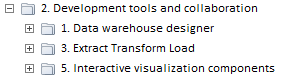
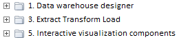

# MetabaseTreeList.getShowRootFolder

MetabaseTreeList.getShowRootFolder
-

# MetabaseTreeList.getShowRootFolder

## Синтаксис

getShowRootFolder()

## Описание

Метод getShowRootFolder определяет,
 отображается ли корневой каталог.

## Комментарии

Метод возвращает true, если
 корневой каталог отображается (по умолчанию), иначе false.
 Установить отображение корневого каталога можно в поле _ShowRootFolder.

Определить, какая из папок будет корневой, можно при помощи свойства
 [MetabaseTreeList.RootKey](MetabaseTreeList.RootKey.htm).

## Пример

Для выполнения примера предполагается наличие на html-странице компонента
 [MetabaseTreeList](../../../Components/Metabase/MetabaseTreeList/MetabaseTreeList.htm)
 с наименованием «list1» (см. «[Пример
 создания компонента MetabaseTreeList](../../../Components/Metabase/MetabaseTreeList/MetabaseTreeList_Example.htm)»). Добавим флажок, при установке
 которого в дереве появляется корневой каталог, а при снятии - скрывается:

        var checkBox = new PP.Ui.CheckBox(
        {
           ParentNode: document.getElementById("div1"),
           Content: "Показывать корневой каталог"
        })
         checkBox.CheckedChanged.add(function (sender, args)
        {
           if (list1.getShowRootFolder() == false)
           {
              list1._ShowRootFolder = true;
              list1.refreshAll()
           }
           else
           {
              list1._ShowRootFolder = false;
              list1.refreshAll()
           }
        })

После выполнения примера на странице будет размещен флажок «Показывать
 корневой каталог». При установке флажка в дереве будет отображаться корневой
 каталог:

При снятии флажка корневой каталог отображаться не будет:

См. также:

[MetabaseTreeList](MetabaseTreeList.htm)

		Справочная
		 система на версию 10.9
		 от 18/08/2025,
		 © ООО «ФОРСАЙТ»,
