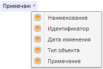

# NavigatorBox.HideObjectListColumnsMenu

NavigatorBox.HideObjectListColumnsMenu
-

# NavigatorBox.HideObjectListColumnsMenu

## Синтаксис

HideObjectListColumnsMenu: Boolean;

## Описание

Свойство HideObjectListColumnsMenu
 определяет, будет ли скрыто меню для столбцов.

## Комментарии

Если установлено значение true,
 меню будет скрыто. По умолчанию установлено значение false,
 то есть меню отображается.

Чтобы вызвать меню для отображения/скрытия столбцов, нажмите на кнопку

 в правом верхнем углу компонента:

## Пример

Пример использования свойства приведен на странице «[Пример
 создания компонента NavigatorBox](../../../Components/Metabase/NavigatorBox/NavigatorBox_Example.htm)».

См. также:

[NavigatorBox](NavigatorBox.htm)

		Справочная
		 система на версию 10.9
		 от 18/08/2025,
		 © ООО «ФОРСАЙТ»,
