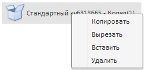

# NavigatorBox.copy

NavigatorBox.copy
-

# NavigatorBox.copy

## Синтаксис

copy();

## Описание

Метод copy добавляет в буфер
 обмена копию выбранных объектов, не изменяя оригинал.

## Комментарии

Метод срабатывает при нажатии на кнопку [ленты](../../../Components/Metabase/NavigatorRibbon/NavigatorRibbon.htm)
 «Копировать» на вкладке «Главная».

## Пример

Для выполнения примера предполагается наличие на странице компонента
 [NavigatorBox](../../../Components/Metabase/NavigatorBox/NavigatorBox.htm)
 с наименованием «navbox» (см. «[Пример
 создания компонента NavigatorBox](../../../Components/Metabase/NavigatorBox/NavigatorBox_Example.htm)»). Добавим контекстное меню для объектов
 в списке:

          navbox.[ObjectListContextMenu](NavigatorBox.ObjectListContextMenu.htm).add(function (sender, args)
          {
             cm.showContext(args.Event.pageX, args.Event.pageY)
          });
           var cm = new PP.Ui.[Menu](dhtmlUi.chm::/Classes/menu/menu.htm)(
          {
             Items: [
             {
                [MenuItem](dhtmlUi.chm::/Classes/menuitem/menuitem.htm): {
                   Content: "Копировать",
                   Id: "copy"
                }
             },
             {
                MenuItem: {
                   Content: "Вырезать",
                   Id: "cut"
                }
             },
             {

                MenuItem: {
                   Content: "Вставить",
                   Id: "paste"
                }
             },
             {
                MenuItem: {
                   Content: "Удалить",
                   Id: "delete"
                }
             }, ]
          });
           cm.getMenuItemById("copy").Click.add(function (sender, args)
          {

             navbox.copy()
          });
          cm.getMenuItemById("cut").Click.add(function (sender, args)
          {
             navbox.cut()
          });
          cm.getMenuItemById("paste").Click.add(function (sender, args)
          {
             navbox.paste()
          });
          cm.getMenuItemById("delete").Click.add(function (sender, args)
          {
             navbox.deleteObjects()
          });

После выполнения примера для объектов в списке будет вызываться следующее
 контекстное меню:

При выборе пункта контекстного меню на объектом будет производиться
 соответствующее действие: копировать, [вырезать](NavigatorBox.cut.htm),
 [вставить](NavigatorBox.paste.htm) или [удалить](NavigatorBox.deleteObjects.htm).

См. также:

[NavigatorBox](NavigatorBox.htm)

		Справочная
		 система на версию 10.9
		 от 18/08/2025,
		 © ООО «ФОРСАЙТ»,
