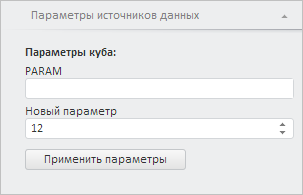

# Конструктор Param

Конструктор Param
-

# Конструктор Param

## Синтаксис

Param(settings);

## Параметры

settings. JSON-объект
 со значениями свойств класса.

## Описание

Конструктор Param создает экземпляр
 класса [Param](Param.htm).

## Пример

Для выполнения примера необходимо наличие на html-странице компонента
 [ExpressBox](dhtmlExpress.chm::/Components/Express/ExpressBox/ExpressBox.htm)
 с наименованием «expressBox» (см. «[Пример
 создания компонента ExpressBox](dhtmlExpress.chm::/Components/Express/ExpressBox/ExpressBox_Example.htm)»), экспресс-отчет должен
 иметь параметр строкового типа с идентификатором «PARAM». Добавим новый
 параметр с этим же идентификатором:

// Создадим новый параметр
var param = new PP.Mb.Param({
    /* Параметр связываем с полем ввода для редактирования целых чисел,
	разрешаем оставлять поле ввода пустым */
    Binding: "UI=\"IntegerEdit\" ALLOWEMPTY=\"TRUE\"",
    Id: "PARAM", // Идентификатор параметра
    Key: 2, // Ключ
    Name: "Новый параметр", // Наименование параметра
    Type: PP.Mb.DbDataType.Integer, // Целый тип
    Value: 12, // Новое значение параметра
    Visible: true, // Делаем параметр видимым
});
// Получим источник данных экспресс-отчёта
var eaxAnalyzer = expressBox.getSource();
// Укажем новые настройки для полученного параметра
if (param.isEmpty()) {
    eaxAnalyzer.setParam(param);
};
// Обновим панель свойств экспресс-отчёта
var propertyBarView = expressBox.getPropertyBarView();
propertyBarView.refreshAll();
// Раскроем панель параметров источников данных
propertyBarView.getItem(PP.Exp.Ui.DataSourceParamsPanel).expand();
console.log("Тип элемента управления: " + param.getPPCreateObj().Data.Binding.UI);

В результате выполнения примера был создан новый параметр с идентификатором
 «PARAM». Он имеет значение, равное 12, ключ, равный 2, наименование
 «Новый параметр», целочисленный тип данных и тип элемента управления,
 предназначенный для отображения целых чисел:

Значение типа данного элемента управления было выведено в консоли браузера:

Тип элемента управления: IntegerEdit

См. также:

[Param](Param.htm)

		Справочная
		 система на версию 10.9
		 от 18/08/2025,
		 © ООО «ФОРСАЙТ»,
