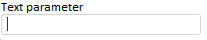

# Конструктор ParamView

Конструктор ParamView
-

# Конструктор ParamView

## Синтаксис

PP.Mb.Ui.ParamView (setiings)

## Параметры

setiings. JSON-объект со значениями свойств класса.

## Описание

Конструктор ParamView создает экземпляр класса [ParamView](ParamView.htm).

## Пример

Для выполнения примера в теге HEAD html-страницы добавьте ссылки на следующие js и css-файлы:

-
PP.js;

-
PP.Metabase.js;

-
PP.Express.js;

-
PP.css;

-
PP.Express.css;

-
файл с ресурсами (например, resources.ru).

Предполагается наличие в репозитории экспресс-отчета с ключом 312. Для источника данных экспресс-отчета должен быть установлен параметр с идентификатором «TEXTPAR1».

В теге SCRIPT добавьте следующий скрипт:

        var eaxAnalyzer, eaxMbService;
        PP.resourceManager.setRootResourcesFolder("../resources/");
        PP.setCurrentCulture(PP.Cultures.ru);
        PP.ImagePath = "../build/img";
        PP.ScriptPath = "../build/";
        PP.CSSPath = "../build/";
        function onReady() {
            //Создаем экземпляр репозитория
            metabase = new PP.Mb.Metabase({
                PPServiceUrl: "PPService.axd?action=proxy",
                Id: "p5lopatina",
                UserCreds: { UserName: "p5lopatina", Password: "p5lopatina" }
            });
            //Открываем репозиторий
            metabase.open();
            //Создаем сервис для работы с экспресс-отчетами
            eaxMbService = new PP.Exp.EaxMdService({ Metabase: metabase });
            //открываем на редактирование экспресс-отчет
            eaxAnalyzer = eaxMbService.edit(312, onEaxReady);
       }
        function onEaxReady() {
            //создаем элемент управления для параметра экспресс-отчета
            param = new PP.Mb.Ui.ParamView({
                Metabase: metabase,
                Source: eaxAnalyzer.getParamById("TEXTPAR1"),
                ParentNode: document.body,
                Width: 200
            });
        };

В атрибуте onready тега BODY пропишите название функции, которая будет выполняться при загрузке страницы:

<body onload="onReady()">

</body>

После выполнения примера на странице будет размещен элемент управления для параметра экспресс-отчета. Данный элемент управления может иметь следующий вид:

См. также:

[ParamView](ParamView.htm)

		Справочная
		 система на версию 10.9
		 от 18/08/2025,
		 © ООО «ФОРСАЙТ»,
