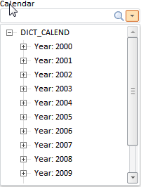

# ParamView.LinkedDimOpened

ParamView.LinkedDimOpened
-

# ParamView.LinkedDimOpened

## Синтаксис

LinkedDimOpened: function (sender, args)

## Параметры

sender. Источник события;

args. Информация о событии:

## Описание

Событие LinkedDimOpened наступает
 после получения измерения параметра.

## Пример

Для выполнения примера предполагается наличие в источнике экспресс-отчета
 с ключом 312 с идентификатором «DIMCOMBO», для которого установлен тип
 редактора значений «Раскрывающийся список справочника». В тело функции
 onEaxReady (см. пример для [конструктора ParamView](Constructor_ParamView.htm)) добавьте
 следующий код:

        //создаем элемент управления для параметра экспресс-отчета
        param = new PP.Mb.Ui.ParamView({
            Metabase: metabase,
            Source: eaxAnalyzer.getParamById("DIMCOMBO"),
            LinkedDimOpened: function (sender, args) { "Идентификатор измерения: " + console.log(args.LinkedDim._Id) },
            ViewReady: function (sender, args) { console.log ("ParamView инициализирован: " + sender.getIsReady() + "\n Название параметра: " + sender.getCurrentParamState().n )},
            ParentNode: document.body,
            Width: 200
        });

После выполнения примера на странице будет размещен раскрывающийся список
 справочника, который является элементом управления для указанного параметра
 экспресс-отчета, например:

 После получения измерения в консоль будет выведен его идентификатор.
 После инициализации компонента в консоли будут выведены сообщения:

ParamView инициализирован: true

 Название параметра: Calendar

См. также:

[ParamView](ParamView.htm)

		Справочная
		 система на версию 10.9
		 от 18/08/2025,
		 © ООО «ФОРСАЙТ»,
