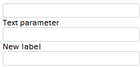

# ParamView.ShowParamLabel

ParamView.ShowParamLabel
-

# ParamView.ShowParamLabel

## Синтаксис

ShowParamLabel: Boolean

## Описание

Свойство ShowParamLabel определяет, будет ли отображаться подпись параметра.

## Комментарии

Если установлено значение true (по умолчанию), то подпись отображается. Если установлено значение false, подпись скрыта.

## Пример

Для выполнения примера в тело функции onEaxReady (см. пример для [конструктора ParamView](Constructor_ParamView.htm)) добавьте следующий код:

            withoutLabel = new PP.Mb.Ui.ParamView({//параметр без подписи
                Metabase: metabase,
                Source: eaxAnalyzer.getParamById("TEXTPAR1"),
                ParentNode: document.body,
                Width: 200,
                ShowParamLabel: false//скрываем подпись параметра
            });
            withLabel = new PP.Mb.Ui.ParamView({//параметр с подписью
                Metabase: metabase,
                Source: eaxAnalyzer.getParamById("TEXTPAR1"),
                ParentNode: document.body,
                Width: 200
            });
            customLabel = new PP.Mb.Ui.ParamView({//параметр с пользовательской подписью
                Metabase: metabase,
                Source: eaxAnalyzer.getParamById("TEXTPAR1"),
                ParentNode: document.body,
                ParamLabel: "New label",
                Width: 200

После выполнения примера на странице будут размещены элементы управления для трех параметров. В первом будет скрыта подпись, во втором подпись, соответствующая названию параметра, будет отображаться, в третьем будет установлена пользовательская подпись «New label»:

См. также:

[ParamView](ParamView.htm)

		Справочная
		 система на версию 10.9
		 от 18/08/2025,
		 © ООО «ФОРСАЙТ»,
