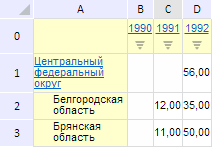

# PropertyChangedEventArgs.Cancel

PropertyChangedEventArgs.Cancel
-

**

# PropertyChangedEventArgs.Cancel

## Синтаксис

Cancel();

## Описание

Метод Cancel** отменяет
 событие, вызываемое при изменении значения свойства.

## Пример

Для выполнения примера необходимо наличие на html-странице компонента
 [ExpressBox](dhtmlExpress.chm::/Components/Express/ExpressBox/ExpressBox.htm)
 с наименованием «expressBox» (см. «[Пример
 создания компонента ExpressBox](dhtmlExpress.chm::/Components/Express/ExpressBox/ExpressBox_Example.htm)») и с загруженной таблицей в рабочей
 области экспресс-отчёта. Отменим событие изменения свойств таблиц, вызванное
 при скрытии её заголовков. Для этого перепишем функцию onPropertyChanged
 в примере, приведённом на [странице
 описания конструктора](Constructor_PropertyChangedEventArgs.htm), следующим образом:

var onPropertyChanged = function (sender, args) {
    // Отменим событие изменения свойства
    args.Args.Cancel();
    // Вызовем событие PropertyChanged
    gridView.PropertyChanged.fire(gridView, args.Args);
};

В результате выполнения примера было отменено событие изменения свойств
 таблицы [PropertyChanged](dhtmlExpress.chm::/Classes/Express/EaxGridView/EaxGridView.PropertyChanged.htm)
 и, как следствие, заголовки таблицы экспресс-отчета остались видимыми:

См. также:

[PropertyChangedEventArgs](PropertyChangedEventArgs.htm)

		Справочная
		 система на версию 10.9
		 от 18/08/2025,
		 © ООО «ФОРСАЙТ»,
