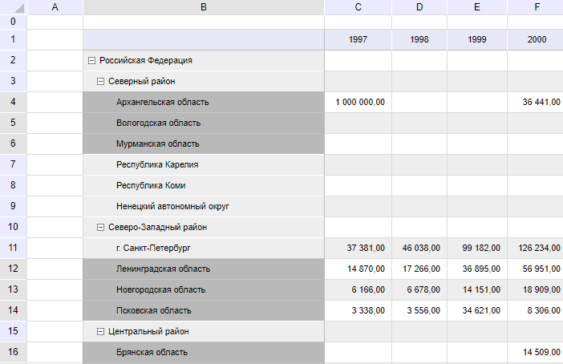

# TabSheetDataSource.search

TabSheetDataSource.search
-

# TabSheetDataSource.search

## Синтаксис

search(text: String, caseSensitive: Boolean, wholeWordsOnly:
 Boolean, direction: [PP.Ui.TabSearchDirection](dhtmlTabSheet.chm::/Enums/TabSearchDirection.htm),
 target: [PP.Ui.TabSearchTarget](dhtmlTabSheet.chm::/Enums/TabSearchTarget.htm),
 range: [PP.Ui.TabSheetRange](dhtmlTabSheet.chm::/Classes/TabSheet/TabSheetRange/TabSheetRange.htm));

## Параметры

text. Строка поиска.

caseSensitive.
 Необязательный параметр. Определение регистра во время поиска.

wholeWordsOnly. Необязательный параметр. Определение
 поиска слова целиком.

direction.
 Необязательный параметр. Направление поиска.

target.
 Необязательный параметр. Свойство ячейки, по которому осуществляется поиск.

range. Диапазон ячеек, по которому осуществляется
 поиск.

## Описание

Метод search осуществляет поиск
 по таблице.

## Пример

Для выполнения примера предполагается наличие на странице компонента
 [GridBox](dhtmlReport.chm::/Components/RegularReport/GridBox/GridBox.htm)
 с наименованием «grid» (см. «[Пример
 размещения компонента GridBox](dhtmlReport.chm::/Components/RegularReport/GridBox/GridBox_example.htm)»). Найдем в таблице ячейки
 со словом «область» и выделим их:

// Получим таблицу
var tabsheet = grid.getTabSheet();
// Получим источник данных таблицы
var source = grid.getTableSource();
// Настроим событие для поиска и выделения ячеек
source.SearchCompleted.add(
    function(sender, args) {
        var result = args.SearchResult || [];
        var ranges = [];
        for (var i = 0; i < result.length; i++)
        {
            var coord = result[i];
            var range = tabsheet.getCell(coord.row, coord.column);
            ranges.push(range);
        }
        tabsheet.select(ranges);
    }
);
// Зададим слово для поиска
source.search("область");
В результате выполнения примера все ячейки, содержащие слово «область»,
 будут выделены:

См. также:

[TabSheetDataSource](TabSheetDataSource.htm)

		Справочная
		 система на версию 10.9
		 от 18/08/2025,
		 © ООО «ФОРСАЙТ»,
