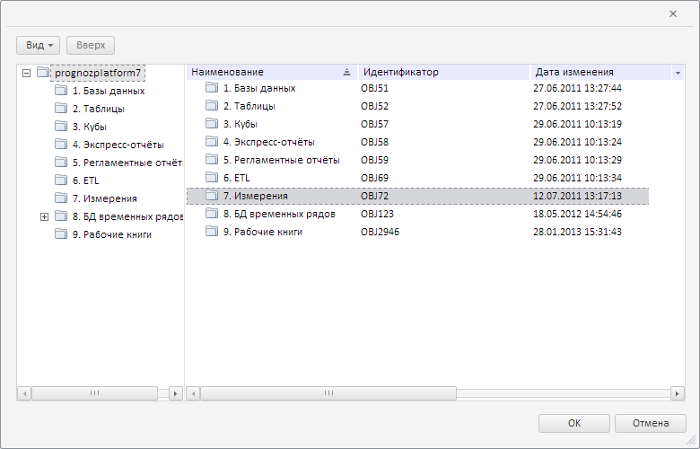
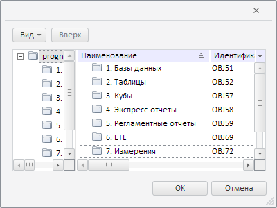

# MetabaseDialogBase.clearSelection

MetabaseDialogBase.clearSelection
-

**

# MetabaseDialogBase.clearSelection

## Синтаксис

clearSelection();

## Описание

Метод clearSelection**
 снимает выделения в базовом диалоге с репозиторием.

## Пример

Для выполнения примера необходимо наличие на html-странице компонента
 [MetabaseDialogBase](../../../Components/Metabase/Dialogs/MetabaseDialogBase/MetabaseDialogBase.htm)
 с наименованием «metabaseDialogBase» (см. «[Пример
 создания компонента MetabaseDialogBase](../../../Components/Metabase/Dialogs/MetabaseDialogBase/MetabaseDialogBase_Example.htm)»). Выделим вручную любой объект
 в базовом диалоге с репозиторием. Например, выберем папку, как показано
 на следующем рисунке:

Теперь снимем все выделения в диалоге, а также уменьшим его размеры:

// Снимем все выделения в диалоге
metabaseDialogBase.clearSelection();
// Определим новые значения ширины и высоты диалога
var width = 120;
var height = 100;
// Изменим размеры диалога
PP.Navigator.MetabaseDialogBase.base.setWidth.call(metabaseDialogBase, width);
PP.Navigator.MetabaseDialogBase.base.setHeight.call(metabaseDialogBase, height);
metabaseDialogBase.recalcSize(width, height + 200);
// Развернём содержимое диалога, чтобы оно соответствовало размерам контейнера
metabaseDialogBase.setCollapsed(false);

В результате выполнения примера все выделения в диалоге были удалены,
 ширина его стала равна 120 пикселям, а высота - 100 пикселям. Чтобы содержимое
 диалога соответствовало размерам контейнера, оно было развёрнуто:

См. также:

[MetabaseDialogBase](MetabaseDialogBase.htm)

		Справочная
		 система на версию 10.9
		 от 18/08/2025,
		 © ООО «ФОРСАЙТ»,
