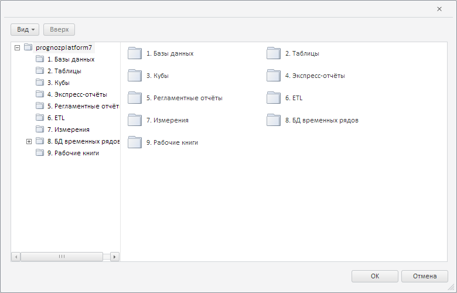

# MetabaseDialogBase.getNavigatorBox

MetabaseDialogBase.getNavigatorBox
-

**

# MetabaseDialogBase.getNavigatorBox

## Синтаксис

getNavigatorBox();

## Описание

Метод getNavigatorBox**
 возвращает контейнер для дерева папок и списка объектов репозитория.

## Комментарии

Метод возвращает объект типа [PP.Mb.Ui.NavigatorBox](../../Metabase/NavigatorBox/NavigatorBox.htm).

## Пример

Для выполнения примера необходимо наличие на html-странице компонента
 [MetabaseDialogBase](MetabaseDialogBase.htm) с наименованием
 «metabaseDialogBase» (см. «[Пример
 создания компонента MetabaseDialogBase](../../../Components/Metabase/Dialogs/MetabaseDialogBase/MetabaseDialogBase_Example.htm)»). Установим в базовом диалоге
 с репозиторием вид списка объектов «Крупные значки»:

// Получим контейнер для дерева папок и списка объектов репозитория
var navigatorBox = metabaseDialogBase.getNavigatorBox();
// Установим для диалога вид «Крупные значки»
navigatorBox.setObjectListMode(PP.Mb.Ui.NavigatorBox.ObjectListMode.Large);

В результате выполнения примера для списка объектов в диалоге был установлен
 вид «Крупные значки»:

См. также:

[MetabaseDialogBase](MetabaseDialogBase.htm)

		Справочная
		 система на версию 10.9
		 от 18/08/2025,
		 © ООО «ФОРСАЙТ»,
