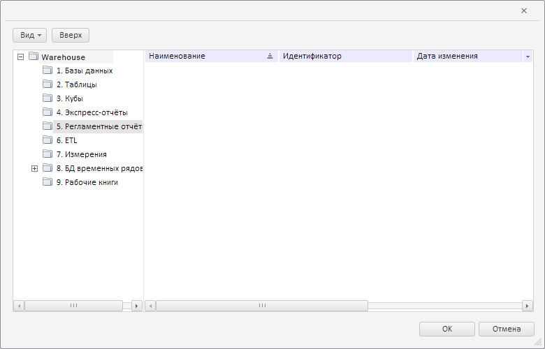

# MetabaseDialogBase.openFoldersTo

MetabaseDialogBase.openFoldersTo
-

**

# MetabaseDialogBase.openFoldersTo

## Синтаксис

openFoldersTo(key: Number);

## Параметры

*key.*
 Ключ папки, которую нужно раскрыть в базовом диалоге с репозиторием.

## Описание

Метод openFoldersTo** раскрывает
 в базовом диалоге с репозиторием папку с указанным ключом.

## Пример

Для выполнения примера необходимо наличие на html-странице компонента
 [MetabaseDialogBase](../../../Components/Metabase/Dialogs/MetabaseDialogBase/MetabaseDialogBase.htm)
 с наименованием «metabaseDialogBase» (см. «[Пример
 создания компонента MetabaseDialogBase](../../../Components/Metabase/Dialogs/MetabaseDialogBase/MetabaseDialogBase_Example.htm)»), а также в репозитории должна
 существовать папка с ключом 117. Откроем данную папку в базовом диалоге
 с репозиторием:

// Определим ключ папки, которую нужно раскрыть в диалоге
var openToKey = 117;
// Отобразим диалог с заданной раскрытой папкой
metabaseDialogBase.openFoldersTo(openToKey);
PP.Navigator.MetabaseDialogBase.base.show.call(metabaseDialogBase);
// Определим путь к раскрытой в диалоге папке
var pathToRoot = metabaseDialogBase.getPathToRoot();
var path = ""; // Строка, содержащая путь
for (var i in pathToRoot) {
    path += "\\";
    path += pathToRoot[i].getName();
};
// Обновим содержимое папки с ключом
metabaseDialogBase.refresh(openToKey);
// Определим ключ раскрытой в диалоге папке
var key = metabaseDialogBase.getParentKey();
console.log("Путь к раскрытой папке: " + path + ", ключ папки: " + key);

В результате выполнения примера в базовом диалоге с репозиторием была
 открыта папка с ключом 117:

Название открытой папки можно узнать из сообщения, выведенного в консоли
 браузера:

Путь к раскрытой папке: \Warehouse\5. Регламентные
 отчёты, ключ папки: 117

См. также:

[MetabaseDialogBase](MetabaseDialogBase.htm)

		Справочная
		 система на версию 10.9
		 от 18/08/2025,
		 © ООО «ФОРСАЙТ»,
