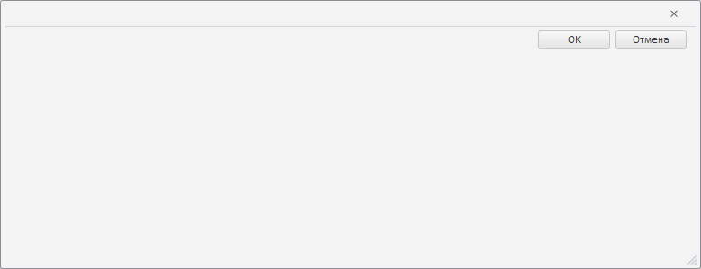

# MetabaseDialogBase.setCollapsed

MetabaseDialogBase.setCollapsed
-

**

# MetabaseDialogBase.setCollapsed

## Синтаксис

setCollapsed(collapsed: Boolean);

## Параметры

*collapsed.*
 Признак свёрнутости содержимого диалога. Если параметр равен значению
 true, то содержимое диалога будет
 свёрнуто, если значению false,
 то развёрнуто. Необязательный параметр, по умолчанию равен значению false.

## Описание

Метод setCollapsed** определяет
 признак свёрнутости содержимого базового диалога с репозиторием.

## Комментарии

Диалог со свёрнутым содержимым будет выглядеть следующим образом:

## Пример

Пример использования приведен на странице описания метода [MetabaseDialogBase.clearSelection](MetabaseDialogBase.clearSelection.htm).

См. также:

[MetabaseDialogBase](MetabaseDialogBase.htm)

		Справочная
		 система на версию 10.9
		 от 18/08/2025,
		 © ООО «ФОРСАЙТ»,
