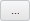

# MetabaseSaveDialog.ShowTranslateButton

MetabaseSaveDialog.ShowTranslateButton
-

**

# MetabaseSaveDialog.ShowTranslateButton

## Синтаксис

ShowTranslateButton: Boolean

## Описание

Свойство ShowTranslateButton**
 управляет видимостью кнопки, при нажатии на которую отображается диалог
 для перевода имени сохраняемого объекта на различные языки.

## Комментарии

Значение свойства устанавливается из JSON и с помощью метода setShowTranslateButton,
 а возвращается - с помощью метода getShowTranslateButton.

Свойство содержит значение true,
 если кнопка, при нажатии на которую отображается диалог для перевода имени
 сохраняемого объекта на различные языки, является видимой, иначе - значение
 false.

Данная кнопка располагается справа от поля ввода наименования сохраняемого
 объекта репозитория и выглядит следующим образом: .
 По умолчанию не отображается.

## Пример

Пример использования свойства приведён на странице «[Пример
 создания компонента MetabaseSaveDialog](../../../Components/Metabase/Dialogs/MetabaseSaveDialog/MetabaseSaveDialog_Example.htm)».

См. также:

[MetabaseSaveDialog](MetabaseSaveDialog.htm)

		Справочная
		 система на версию 10.9
		 от 18/08/2025,
		 © ООО «ФОРСАЙТ»,
