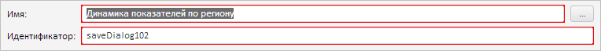

# MetabaseSaveDialog.getIdControl

MetabaseSaveDialog.getIdControl
-

**

# MetabaseSaveDialog.getIdControl

## Синтаксис

getIdControl();

## Описание

Метод getIdControl** возвращает
 текстовое поле для ввода идентификатора сохраняемого объекта.

## Комментарии

Метод возвращает объект типа [PP.Ui.TextBox](dhtmlUi.chm::/Classes/TextBox/TextBox.htm).

## Пример

Для выполнения примера необходимо наличие на html-странице компонента
 [MetabaseSaveDialog](../../../Components/Metabase/Dialogs/MetabaseSaveDialog/MetabaseSaveDialog.htm)
 с наименованием «saveDialog» (см. «[Пример
 создания компонента MetabaseSaveDialog](../../../Components/Metabase/Dialogs/MetabaseSaveDialog/MetabaseSaveDialog_Example.htm)»). Установим красный цвет заливки
 для блоков, содержащих поля для ввода идентификатора и имени сохраняемого
 объекта:

// Получим поля для ввода имени и идентификатора сохраняемого объекта
var nameControl = saveDialog.getNameControl();
var idControl = saveDialog.getIdControl();
// Определим новый стиль для полей ввода
var style = "background-color: " + PP.Color.Colors.red + "; padding: 1px";
// Установим красный цвет заливки для блоков, содержащих данные поля ввода
nameControl.setStyle(style);
idControl.setStyle(style);

В результате выполнения примера для блоков, содержащих поля для ввода
 идентификатора и имени сохраняемого объекта, был установлен красный цвет
 заливки:

См. также:

[MetabaseSaveDialog](MetabaseSaveDialog.htm)

		Справочная
		 система на версию 10.9
		 от 18/08/2025,
		 © ООО «ФОРСАЙТ»,
