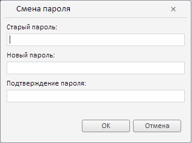
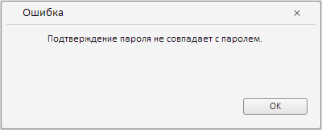

# Пример создания компонента ChangePasswordDialog

Пример создания компонента ChangePasswordDialog
-

# Пример создания компонента ChangePasswordDialog

Для выполнения примера подключите ссылки на библиотеку компонентов PP.js,
 визуальные стили PP.js и файл ресурсов resources.ru.js. В теге BODY добавьте
 следующий код:

После выполнения примера на странице будут размещены кнопка «Сменить
 пароль» и три [подписи](dhtmlUi.chm::/Classes/Label/Label.htm):

Старый пароль:

Новый пароль:

Подтверждение пароля:

При нажатии на кнопку «Сменить пароль» будет вызван диалог для смены
 пароля, имеющий следующий вид:

После заполнения полей диалога и нажатия на кнопку OK содержимое подписей
 на странице будет заполнено введенными значениями, например:

Старый пароль: qwerty

Новый пароль: qwerty123

Подтверждение пароля: qwerty123

Если новый пароль и подтверждение пароля совпадают, на экран будет выведено
 сообщение «Пароли совпадают», иначе будет выведен диалог с сообщением
 об ошибке:

См. также:

[ChangePasswordDialog](ChangePasswordDialog.htm)

		Справочная
		 система на версию 10.9
		 от 18/08/2025,
		 © ООО «ФОРСАЙТ»,
