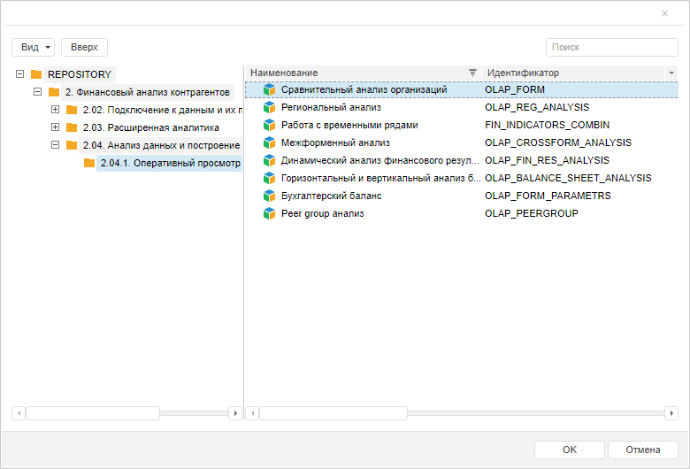

# Пример создания компонента MetabaseDialogBase

Пример создания компонента MetabaseDialogBase
-

# Пример создания компонента MetabaseDialogBase

Перед выполнением примера ознакомьтесь с [рекомендациями](dhtml.chm::/specification/JavaScript_main.htm)
 к написанию кода. Убедитесь, что в репозитории содержится эксресс-отчёт
 с ключом «88665».

Для создания компонента MetabaseDialogBase
 используйте HTML-код:

<!DOCTYPE html PUBLIC "-//W3C//DTD XHTML 1.0 Transitional//EN" "http://www.w3.org/TR/xhtml1/DTD/xhtml1-transitional.dtd">
<html xmlns="http://www.w3.org/1999/xhtml">
<head>
    <meta http-equiv="X-UA-Compatible" content="IE=edge" />
    <title>MetabaseDialogBase</title>
    
    
    
    
    
    
    
    <link href="../build/PP.css" rel="stylesheet" type="text/css" />
    <link href="../build/PP.Metabase.css" rel="stylesheet" type="text/css" />
    <link href="../build/PP.Express.css" rel="stylesheet" type="text/css" />

    
</head>
<body onload="onLoad();">
</body>
</html>

После выполнения примера на html-странице будет размещён компонент [MetabaseDialogBase](MetabaseDialogBase.htm):

В соответствии с установленным фильтром в диалоге будут отображаться
 только экспресс-отчёты из всех объектов репозитория.

См. также:

[MetabaseDialogBase](MetabaseDialogBase.htm)

		Справочная
		 система на версию 10.9
		 от 18/08/2025,
		 © ООО «ФОРСАЙТ»,
