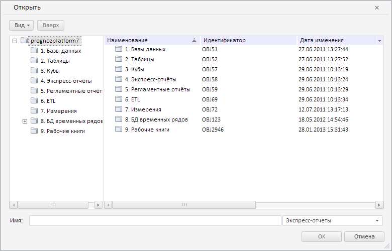

# Пример создания компонента MetabaseOpenDialog

Пример создания компонента MetabaseOpenDialog
-

# Пример создания компонента MetabaseOpenDialog

Для выполнения примера необходимо создать html-страницу и выполнить
 следующие действия:

1. Добавить ссылки на следующие css-файлы: PP.css и PP.Metabase.css.

Также нужно добавить ссылки на js-файлы: PP.js, PP.Metabase.js, PP.Express.js,
 resources.ru.js.

2. Затем в теге <head> добавить сценарий, который создаст диалог
 для сохранения объекта в репозитории:

3. В теге <body> в качестве значения атрибута «onLoad» указать
 название функции, создающей диалог для сохранения объекта в репозиторий:

<body onload="onLoad();"></body>
После выполнения примера на html-странице будет размещён компонент [MetabaseOpenDialog](MetabaseOpenDialog.htm):

См. также:

[MetabaseOpenDialog](MetabaseOpenDialog.htm)

		Справочная
		 система на версию 10.9
		 от 18/08/2025,
		 © ООО «ФОРСАЙТ»,
