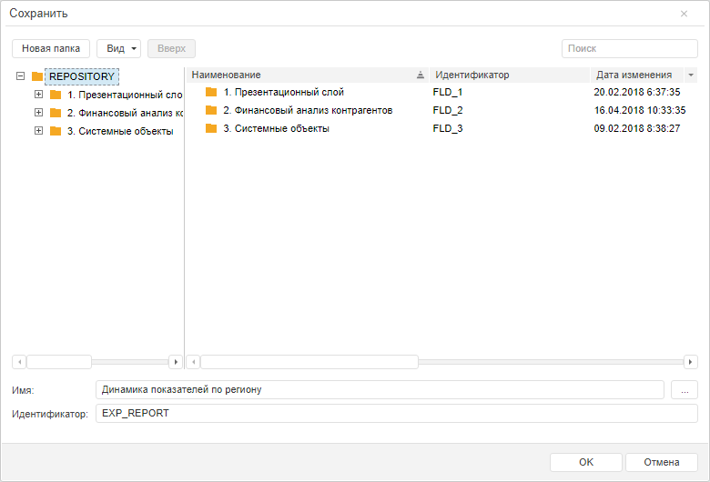

# Пример создания компонента MetabaseSaveDialog

Пример создания компонента MetabaseSaveDialog
-

# Пример создания компонента MetabaseSaveDialog

Перед выполнением примера ознакомьтесь с [рекомендациями](dhtml.chm::/specification/JavaScript_main.htm)
 к написанию кода. Убедитесь, что в репозитории содержится эксресс-отчёт
 с ключом «88665».

Для создания компонента MetabaseSaveDialog
 используйте HTML-код:

<!DOCTYPE html PUBLIC "-//W3C//DTD XHTML 1.0 Transitional//EN" "http://www.w3.org/TR/xhtml1/DTD/xhtml1-transitional.dtd">
<html xmlns="http://www.w3.org/1999/xhtml">
<head>
    <meta http-equiv="X-UA-Compatible" content="IE=edge" />
    <title>MetabaseSaveDialog</title>
    
    
    
    
    
    
    
    <link href="../build/PP.css" rel="stylesheet" type="text/css" />
    <link href="../build/PP.Metabase.css" rel="stylesheet" type="text/css" />
    <link href="../build/PP.Express.css" rel="stylesheet" type="text/css" />

    
</head>
<body onload="onLoad();">
</body>
</html>

После выполнения примера на html-странице будет размещён компонент [MetabaseSaveDialog](MetabaseSaveDialog.htm):

После нажатия на кнопку «OK» будет сгенерировано событие [SaveAsObject](../../../../Classes/Navigator/MetabaseSaveDialog/MetabaseSaveDialog.SaveAsObject.htm)
 и выведено сообщение в консоль браузера:

Имя сохранённого объекта на разных языках:

Код языка: 1033, имя: Dynamics indicators by region

Код языка: 1049, имя: Динамика показателей по региону

См. также:

[MetabaseSaveDialog](MetabaseSaveDialog.htm)

		Справочная
		 система на версию 10.9
		 от 18/08/2025,
		 © ООО «ФОРСАЙТ»,
