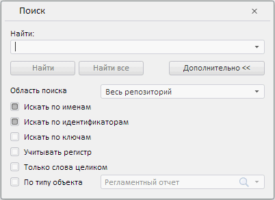

# Пример создания компонента SearchDialog

Пример создания компонента SearchDialog
-

# Пример создания компонента SearchDialog

Для выполнения примера в теге HEAD *.html-страницы подключите ссылки
 на следующие *.js и *.css-файлы:

	- PP.js;

	- PP.css;

	- PP.Metabase.js;

	- PP.Metabase.css;

	- PP.Navigator.js;

	- PP.Navigator.css.

В теге BODY добавьте следующий код:

<body onload="onLoad();" style ="height:600px">
</body>
В теге SCRIPT добавьте скрипт для создания компонента:

После выполнения примера на странице будет размещен компонент SearchDialog, имеющий следующий
 вид:

Введите в строку поиска текст, по которому нужно найти объекты репозитория.
 При нажатии на кнопку «Найти» в консоль будет выведены название, порядковый
 номер и свойства найденного объекта. При нажатии на кнопку «Найти все»
 в консоль будут выведены названия, порядковые номера и свойства найденных
 объектов. Например:

 Object #0

    @ts : 2011-07-19T15:43:23.000

    @isShortcut : false

    @isLink : false

    @hf : false

    i : OBJ3557

    n : World Indicators

    k : 3557

    c : 0

    p : 4294967295

    h : false

См. также:

[SearchDialog](SearchDialog.htm)

		Справочная
		 система на версию 10.9
		 от 18/08/2025,
		 © ООО «ФОРСАЙТ»,
