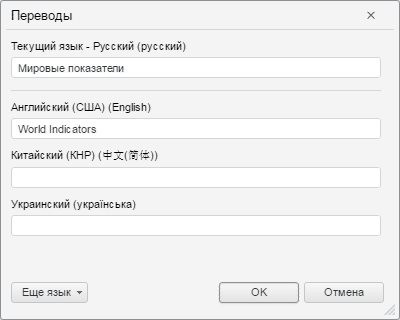
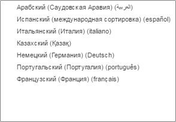

# Пример создания компонента TranslateDialog

Пример создания компонента TranslateDialog
-

# Пример создания компонента TranslateDialog

Для выполнения примера в теге HEAD добавьте ссылки на следующие *.js
 и *.css-файлы:

	- PP.js;

	- PP.Metabase.js;

	- PP.css;

	- PP.Metabase.css;

	- файл ресурсов (например, resources.ru.js).

В теге SCRIPT добавьте следующий код:

    var translateDialog,
        //Коды языков, отображающихся в диалоге
        displayLanguages = [1033, 2052, 1049, 1058],
        //Коды языков, отображающихся в раскрывающемся меню «Еще язык»
        additionalLanguages = [1033, 1025, 3082, 1040, 1087, 2052, 1031, 2070, 1049, 1058, 1036],
        //Текст в строках ввода для русского и английского языков
        translations = { 1033: "World Indicators", 1049: "Мировые показатели" };
    function onLoad() {
        //Папка с ресурасами
        PP.resourceManager.setRootResourcesFolder("../resources/");
        //Текущий язык интерфейса
        PP.setCurrentCulture(PP.Cultures.ru);
        //Создаем новый диалог «Переводы»
        translateDialog = new PP.Mb.Ui.TranslateDialog({
            ImagePath: "../build/img/",
            //Текст в строках ввода
            Translations: translations,
            Mode: PP.Mb.TranslateMode.Languages,
            //Массив языков, отображающихся в диалоге
            DisplayLanguages: displayLanguages,
            //Отобразим кнопку «Еще»
            ShowLanguagesButton: true,
            //Массив языков, отображающихся в раскрывающемся меню «Еще язык»
            AdditionalLanguages: additionalLanguages,
            //Обработка события нажатия кнопки «OK»
            OkButtonClicked: function (sender, args) {
                alert(JSON.stringify(args.DialogResult.Translations));
            }
        });
        //Открываем диалог
        translateDialog.show();
    }
В теге BODY добавьте метод для вызова функции onLoad:

<body onload="onLoad();"><body>
После выполнения примера на странице будет открыт диалог «Переводы»,
 имеющий следующий вид:

При нажатии на кнопку «Еще язык» будет доступен список языков, коды
 которых заданы в свойстве AdditionalLanguages:

См. также:

[TranslateDialog](TranslateDialog.htm)

		Справочная
		 система на версию 10.9
		 от 18/08/2025,
		 © ООО «ФОРСАЙТ»,
