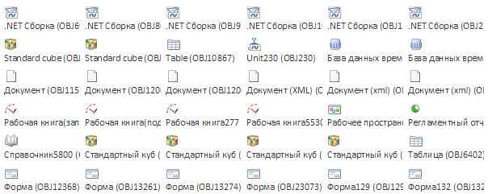

# Пример создания компонента MetabaseObjectsIconView

Пример создания компонента MetabaseObjectsIconView
-

# Пример создания компонента MetabaseObjectsIconView

Для выполнения примера в теге HEAD html-страницы добавьте ссылки на
 следующие js и css-файлы:

	- PP.js;

	- PP.Metabase.js;

	- файл с ресурсами (например, resources.ru);

	- PP.css.

В теге SCRIPT добавьте следующий скрипт:

        // Функция, которая будет выполняться при загрузке страницы
        function onLoad() {
            mb = new PP.Mb.Metabase({
                Id: "WAREHOUSE",
                UserCreds: new PP.Mb.UserCreds({
                    UserName: "user",
                    Password: "password"
                })
            });
            //Открываем репозиторий
            mb.open()
            // Создаем
            list1 = new PP.Mb.Ui.MetabaseObjectsIconView({
                // Ключ корневой папки
                RootKey: 67,

                // Репозиторий, откуда берутся данные
                Metabase: mb,
                ParentNode: document.getElementById("mtl"),
                // Высота объектов
                ItemHeight: 40,
                // Ширина объектов
                ItemWidth: 100,
                // Вариант отображения списка объектов - огромные значки
                IconType: PP.Mb.Ui.NavigatorBox.ObjectListMode.Giant,
                // Тип ориентации объектов - горизонтальная ориентация
                Orientation: "Horizontal"
            });
        };
В теге
 BODY добавьте атрибут onload и
 элемент div с идентификатором
 «mtl»:

<body
 onload="onLoad();">

    

 </body>

После выполнения примера на html-странице будет размещен компонент [MetabaseObjectsIconView](MetabaseObjectsIconView.htm), имеющий
 следующий вид:

См. также:

[MetabaseObjectsIconView](MetabaseObjectsIconView.htm)

		Справочная
		 система на версию 10.9
		 от 18/08/2025,
		 © ООО «ФОРСАЙТ»,
