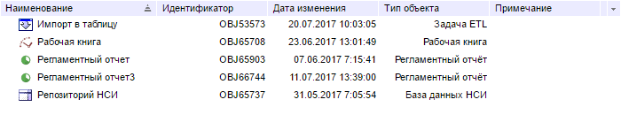

# Пример создания компонента MetabaseObjectsListView

Пример создания компонента MetabaseObjectsListView
-

# Пример создания компонента MetabaseObjectsListView

Для выполнения примера в теге HEAD html-страницы добавьте ссылки на
 следующие js и css-файлы:

	- PP.js;

	- PP.Metabase.js;

	- PP.css.

	- файл с ресурсами (например, resources.ru);

В теге SCRIPT добавьте следующий скрипт:

 PP.ImagePath = "build/img/";
 PP.ScriptPath = "build/";
 var IMAGE_PATH = "build/img/"; // Путь к папке с пиктограммами
 // Укажем путь к корневой папке, содержащей файлы ресурсов
 PP.resourceManager.setRootResourcesFolder("resources/");
 // Установим языковые настройки для ресурсов
 PP.setCurrentCulture(PP.Cultures.ru);
 var metabase = new PP.Mb.Metabase({
     PPServiceUrl: "PPService.axd",
     Id: "WAREHOUSE",
     UserCreds: {
         UserName: "user",
         Password: "password"
     }
 });
 // Открываем соединение с репозиторием
 metabase.open();
 // Создаем компонент MetabaseObjectsListView
 list = new PP.Mb.Ui.MetabaseObjectsListView({
     // Ключ корневой папки
     RootKey: 53569,
     // Репозиторий, откуда берутся данные
     Metabase: metabase,
     ParentNode: "MetabaseObjectsListView",
     // Ширина и высота компонента
     Width: 700,
     Height: 130,
     });
В теге BODY добавьте элемент div с идентификатором
 «MetabaseObjectsListView»:

 <body>
         

 </body>
После выполнения примера на html-странице будет размещен компонент [MetabaseObjectsListView](MetabaseObjectsListView.htm), имеющий
 следующий вид:

См. также:

[MetabaseObjectsListView](MetabaseObjectsListView.htm)

		Справочная
		 система на версию 10.9
		 от 18/08/2025,
		 © ООО «ФОРСАЙТ»,
