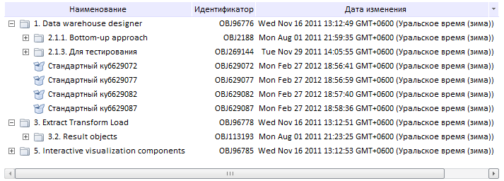

# MetabaseTreeList

MetabaseTreeList
-

# MetabaseTreeList

## Описание

Компонент MetabaseTreeList представляет
 собой иерархическое дерево объектов репозитория. Каждый элемент дерева
 является ссылкой на соответствующий объект репозитория.

## Комментарии

Компонент реализован классом [MetabaseTreeList](../../../Classes/Metabase/MetabaseTreeList/MetabaseTreeList.htm).

Выбрать типы объектов, которые будут отображаться в дереве можно при
 помощи свойства [Filter](../../../Classes/Metabase/MetabaseTreeList/MetabaseTreeList.Filter.htm).

Определить, будут ли отображаться столбцы с атрибутами объектов репозитория,
 можно при помощи свойства [ShowAttributes](../../../Classes/Metabase/MetabaseTreeList/MetabaseTreeList.ShowAttributes.htm).

Скрыть пустые папки можно при помощи свойства [ShowEmptyFolder](../../../Classes/Metabase/MetabaseTreeList/MetabaseTreeList.ShowEmptyFolder.htm).

Чтобы ширина столбцов выравнивалась по содержимому, используйте метод
 [adjustColumnsWidthByContent](../../../Classes/Metabase/MetabaseTreeList/MetabaseTreeList.adjustColumnsWidthByContent.htm).

## Пример

Компонент может выглядеть следующим образом:

[Пример создания компонента MetabaseTreeList](MetabaseTreeList_Example.htm)

## Конструктор

		 Имя конструктора
		 Краткое описание

		 
		 [MetabaseTreeList](dhtmlMetabase.chm::/classes/metabase/metabasetreelist/constructor_metabasetreelist.htm)
		 Конструктор MetabaseTreeList
		 создает экземпляр класса MetabaseTreeList.

## Свойства

		 Имя свойства
		 Краткое описание

		 
		 [DisplayMode](dhtmlMetabase.chm::/classes/metabase/metabasetreelist/metabasetreelist.displaymode.htm)
		 Свойство DisplayMode
		 определяет, что будет отображаться в заголовке вершины: название,
		 идентификатор или название и идентификатор объекта.

		 
		 [EmptySelection](dhtmlMetabase.chm::/classes/metabase/metabasetreelist/metabasetreelist.emptyselection.htm)
		 Свойство EmptySelection
		 определяет, можно ли снять отметку полностью со всех элементов
		 дерева.

		 
		 [ExpandedKeys](dhtmlMetabase.chm::/classes/metabase/metabasetreelist/metabasetreelist.expandedkeys.htm)
		 Свойство ExpandedKeys
		 устанавливает ключ объекта или массив ключей объектов, которые
		 отображаются в дереве как развернутые вершины.

		 
		 [Filter](dhtmlMetabase.chm::/classes/metabase/metabasetreelist/metabasetreelist.filter.htm)
		 Свойство Filter определяет
		 список типов объектов, отображаемых в дереве компонента.

		 
		 [Metabase](dhtmlMetabase.chm::/classes/metabase/metabasetreelist/metabasetreelist.metabase.htm)
		 Свойство Metabase
		 определяет репозиторий, из которого буду браться данные для построения
		 дерева.

		 
		 [MultiSelect](dhtmlMetabase.chm::/classes/metabase/metabasetreelist/metabasetreelist.multiselect.htm)
		 Свойство MultiSelect
		 определяет, возможен ли множественный выбор элементов дерева.

		 
		 [RootKey](dhtmlMetabase.chm::/classes/metabase/metabasetreelist/metabasetreelist.rootkey.htm)
		 Свойство RootKey устанавливает
		 ключ корневой папки.

		 
		 [SelectedKeys](dhtmlMetabase.chm::/classes/metabase/metabasetreelist/metabasetreelist.selectedkeys.htm)
		 Свойство SelectedKeys
		 устанавливает массив ключей выделенных объектов.

		 
		 [ShowAttributes](dhtmlMetabase.chm::/classes/metabase/metabasetreelist/metabasetreelist.showattributes.htm)
		 Свойство ShowAttributes
		 определяет, будут ли отображаться столбцы с атрибутами объектов.

		 
		 [ShowEmptyFolder](dhtmlMetabase.chm::/classes/metabase/metabasetreelist/metabasetreelist.showemptyfolder.htm)
		 Свойство ShowEmptyFolder
		 определяет, будут ли отображаться в дереве пустые папки.

		 
		 [ShowOnlyFolders](dhtmlMetabase.chm::/Classes/Metabase/MetabaseTreeList/MetabaseTreeList.ShowOnlyFolders.htm)
		 Свойство ShowOnlyFolders
		 устанавливает коллекцию ключей папок, которые будут отображаться
		 в компоненте.

## Методы

		 Имя метода
		 Краткое описание

		 
		 [addFilter](dhtmlMetabase.chm::/classes/metabase/metabasetreelist/metabasetreelist.addfilter.htm)
		 Метод addFilter добавляет
		 список типов объектов, которые будут отображаться в дереве.

		 
		 [adjustColumnsWidthByContent](dhtmlMetabase.chm::/classes/metabase/metabasetreelist/metabasetreelist.adjustcolumnswidthbycontent.htm)
		 Метод adjustColumnsWidthByContent
		 выравнивает ширину столбцов по содержимому.

		 
		 [clearFilter](dhtmlMetabase.chm::/classes/metabase/metabasetreelist/metabasetreelist.clearfilter.htm)
		 Метод clearFilter очищает
		 список типов объектов, отображающихся в дереве.

		 
		 [clearSelection](dhtmlMetabase.chm::/Classes/Metabase/MetabaseTreeList/MetabaseTreeList.clearSelection.htm)
		 Метод clearSelection
		 снимает выделение со всех вершин дерева.

		 
		 [deSelectAll](dhtmlMetabase.chm::/classes/metabase/metabasetreelist/metabasetreelist.deselectall.htm)
		 Метод deSelectAll снимает
		 отметку со всех вершин дерева.

		 
		 [expandNodesTo](dhtmlMetabase.chm::/classes/metabase/metabasetreelist/metabasetreelist.expandnodesto.htm)
		 Метод expandNodesTo
		 разворачивает все папки, в которых содержится объект с указанным
		 ключом.

		 
		 [find](dhtmlMetabase.chm::/Classes/Metabase/MetabaseTreeList/MetabaseTreeList.find.htm)
		 Метод find
		 производит поиск объектов в дереве.

		 
		 [getMbObjectByKey](dhtmlMetabase.chm::/classes/metabase/metabasetreelist/metabasetreelist.getmbobjectbykey.htm)
		 Метод getMbObjectByKey
		 возвращает объект репозитория по ключу.

		 
		 [getPathToRoot](dhtmlMetabase.chm::/classes/metabase/metabasetreelist/metabasetreelist.getpathtoroot.htm)
		 Метод getPathToRoot
		 возвращает массив объектов или их ключей, в которые вложен указанный
		 объект.

		 
		 [getSelectedObjects](dhtmlMetabase.chm::/classes/metabase/metabasetreelist/metabasetreelist.getselectedobjects.htm)
		 Метод getSelectedObjects
		 возвращает массив выбранных объектов - экземпляров класса PP.Mb.[Object](dhtmlMetabase.chm::/Classes/Metabase/Object/Object.htm).

		 
		 [getShowRootFolder](dhtmlMetabase.chm::/classes/metabase/metabasetreelist/metabasetreelist.getshowrootfolder.htm)
		 Метод getShowRootFolder
		 определяет, отображается ли корневая папка.

		 
		 [invertSelection](dhtmlMetabase.chm::/classes/metabase/metabasetreelist/metabasetreelist.invertselection.htm)
		 Метод invertSelection
		 инвертирует отметку в дереве объектов, то есть отмечает те элементы,
		 которые не были отмечены, и снимает отметку с тех, которые были
		 отмечены.

		 
		 [refresh](dhtmlMetabase.chm::/classes/metabase/metabasetreelist/metabasetreelist.refresh.htm)
		 Метод refresh обновляет
		 вершину дерева по ключу.

		 
		 [refreshAll](dhtmlMetabase.chm::/classes/metabase/metabasetreelist/metabasetreelist.refreshall.htm)
		 Метод refreshAll обновляет
		 все дерево объектов репозитория.

		 
		 [selectAll](dhtmlMetabase.chm::/classes/metabase/metabasetreelist/metabasetreelist.selectall.htm)
		 Метод selectAll выделяет
		 все вершины дерева.

## События

		 Имя события
		 Краткое описание

		 
		 [NodeClick](dhtmlMetabase.chm::/classes/metabase/metabasetreelist/metabasetreelist.nodeclick.htm)
		 Событие NodeClick наступает
		 при нажатии на вершину дерева.

		 
		 [NodeDblClick](dhtmlMetabase.chm::/classes/metabase/metabasetreelist/metabasetreelist.nodedblclick.htm)
		 Событие NodeDblClick
		 наступает при двойном щелчке по вершине дерева.

		 
		 [NodesLoaded](dhtmlMetabase.chm::/classes/metabase/metabasetreelist/metabasetreelist.nodesloaded.htm)
		 Событие NodesLoaded
		 наступает после загрузки всех вершин дерева.

		 
		 [SelectionChanged](dhtmlMetabase.chm::/classes/metabase/metabasetreelist/metabasetreelist.selectionchanged.htm)
		 Событие SelectionChanged
		 наступает после изменения отметки в дереве объектов репозитория.

## Метод, унаследованный от класса [ProxyControl](dhtmlUi.chm::/Classes/ProxyControl/ProxyControl.htm)

		 Имя метода
		 Краткое описание

		 
		 [getControl](dhtmlUi.chm::/classes/proxycontrol/proxycontrol.getcontrol.htm)
		 Метод getControl возвращает
		 базовый элемент управления - наследник PP.Ui.Control.

## Свойства, унаследованные от класса [Control](dhtmlUi.chm::/Classes/control/control.htm)

		 Имя свойства
		 Краткое описание

		 
		 [Anchors](dhtmlUi.chm::/Classes/Control/Control.Anchors.htm)
		 Свойство Anchors определяет
		 позицию компонента, размещенного внутри контейнера.

		 
		 [Animation](dhtmlUi.chm::/Classes/Control/Control.Animation.htm)
		 Свойство Animation
		 определяет параметры анимации для компонента.

		 
		 [Bottom](dhtmlUi.chm::/Classes/Control/Control.Bottom.htm)
		 Свойство Bottom определяет
		 отступ снизу при размещении компонента внутри LayoutPanel.

		 
		 [Content](dhtmlUi.chm::/classes\control\control.content.htm)
		 Свойство Content определяет
		 содержимое компонента.

		 
		 [ContextMenu](dhtmlUi.chm::/Classes\Control\Control.ContextMenu.htm)
		 Свойство ContextMenu
		 определяет контекстное меню для компонента.

		 
		 [Data](dhtmlUi.chm::/Classes/Control/Control.Data.htm)
		 Свойство Data предназначено
		 для хранения любых пользовательских данных.

		 
		 [Enabled](dhtmlUi.chm::/classes\control\control.enabled.htm)
		 Свойство Enabled определяет
		 признак доступности компонента для использования.

		 
		 [Height](dhtmlUi.chm::/classes\control\control.height.htm)
		 Свойство Height определяет
		 высоту компонента.

		 
		 [IsRTL](dhtmlUi.chm::/classes\control\control.isrtl.htm)
		 Свойство IsRTL определяет
		 признак расположения элементов компонента по правому краю.

		 
		 [IsVisible](dhtmlUi.chm::/Classes/Control/Control.IsVisible.htm)
		 Свойство IsVisible
		 определяет признак отображения компонента.

		 
		 [Left](dhtmlUi.chm::/Classes/Control/Control.Left.htm)
		 Свойство Left определяет
		 отступ слева при размещении компонента внутри [GridPanel](dhtmlUi.chm::/Components/GridPanel/GridPanel.htm).

		 
		 [Opacity](dhtmlUi.chm::/Classes/Control/Control.Opacity.htm)
		 Свойство Opacity определяет
		 прозрачность компонента.

		 
		 [Parent](dhtmlUi.chm::/Classes/Control/Control.Parent.htm)
		 Свойство Parent определяет
		 родительский компонент элемента управления.

		 
		 [ParentNode](dhtmlUi.chm::/Classes/Control/Control.ParentNode.htm)
		 Свойство ParentNode
		 определяет родительскую DOM-вершину.

		 
		 [ResourceKey](dhtmlUi.chm::/classes\control\control.resourcekey.htm)
		 Свойство ResourceKey
		 определяет ресурсный ключ для компонента.

		 
		 [Right](dhtmlUi.chm::/Classes/Control/Control.Right.htm)
		 Свойство Right определяет
		 отступ справа при размещении компонента внутри LayoutPanel.

		 
		 [Rotate](dhtmlUi.chm::/Classes/Control/Control.Rotate.htm)
		 Свойство Rotate определяет
		 угол поворота компонента.

		 
		 [ShowToolTip](dhtmlUi.chm::/Classes/Control/Control.ShowToolTip.htm)
		 Свойство ShowToolTip
		 определяет признак возможности отображения [всплывающей
		 подсказки](dhtmlUi.chm::/Classes/Control/Control.ToolTip.htm) компонента.

		 
		 [Style](dhtmlUi.chm::/Classes/Control/Control.Style.htm)
		 Свойство Style определяет
		 стиль для компонента.

		 
		 [TabIndex](dhtmlUi.chm::/classes\control\control.tabindex.htm)
		 Свойство TabIndex определяет
		 последовательность перехода элемента управления внутри контейнера.

		 
		 [Tag](dhtmlUi.chm::/Classes/Control/Control.Tag.htm)
		 Свойство Tag определяет
		 JSON-объект, ассоциированный с компонентом.

		 
		 [ToolTip](dhtmlUi.chm::/classes\control\control.tooltip.htm)
		 Свойство ToolTip определяет
		 текст всплывающей подсказки компонента.

		 
		 [Top](dhtmlUi.chm::/Classes/Control/Control.Top.htm)
		 Свойство Top определяет
		 отступ сверху при размещении компонента внутри [GridPanel](dhtmlUi.chm::/Components/GridPanel/GridPanel.htm).

		 
		 [Value](dhtmlUi.chm::/classes\control\control.value.htm)
		 Свойство Value определяет
		 значение компонента.

		 
		 [Width](dhtmlUi.chm::/classes\control\control.width.htm)
		 Свойство Width определяет
		 ширину компонента.

## Методы, унаследованные от класса [Control](dhtmlUi.chm::/Classes/control/control.htm)

		 Имя метода
		 Краткое описание

		 
		 [addClass](dhtmlUi.chm::/classes\control\control.addclass.htm)

		 Метод addClass добавляет
		 CSS-класс к компоненту.

		 
		 [addEventHandler](dhtmlUi.chm::/Classes/Control/Control.addEventHandler.htm)
		 Метод addEventHandler
		 добавляет обработчик события на DOM-вершину.

		 
		 [addStateClass](dhtmlUi.chm::/Classes/Control/Control.addStateClass.htm)

		 Метод addStateClass
		 добавляет CSS-класс к компоненту и удаляет прежний CSS-класс.

		 
		 [addToNode](dhtmlUi.chm::/classes\control\control.addtonode.htm)

		 Метод addToNode добавляет
		 компонент в указанную вершину.

		 
		 [bindEvents](dhtmlUi.chm::/Classes/Control/Control.bindEvents.htm)
		 Метод bindEvents подписывает
		 элемент на все стандартные события.

		 
		 [getAnchorFlags](dhtmlUi.chm::/Classes/Control/Control.getAnchorFlags.htm)

		 Метод getAnchorFlags
		 возвращает JSON-объект с настройками текущей позиции компонента.

		 
		 [getClass](dhtmlUi.chm::/classes\control\control.getclass.htm)

		 Метод getClass возвращает
		 текущие css-классы компонента.

		 
		 [getCssStyle](dhtmlUi.chm::/Classes/Control/Control.getCssStyle.htm)

		 Метод getCssStyle возвращает
		 стили для указанной вершины.

		 
		 [getDomNode](dhtmlUi.chm::/Classes/Control/Control.getDomNode.htm)

		 Метод getDomNode возвращает
		 главную DOM-вершину компонента.

		 
		 [getFocused](dhtmlUi.chm::/Classes/Control/Control.getFocused.htm)

		 Метод getFocused определяет
		 наличие фокуса у компонента.

		 
		 [getIsBinded](dhtmlUi.chm::/Classes/Control/Control.getIsBinded.htm)
		 Метод getIsBinded возвращает
		 признак подписи элемента на события DOM-вершины.

		 
		 [hide](dhtmlUi.chm::/classes\control\control.hide.htm)

		 Метод hide скрывает
		 элемент управления.

		 
		 [hideToolTip](dhtmlUi.chm::/Classes/Control/Control.hideToolTip.htm)

		 Метод hideToolTip очищает
		 таймаут появления подсказки и скрывает её, если она был показана.

		 
		 [refreshStyle](dhtmlUi.chm::/Classes/Control/Control.refreshStyle.htm)
		 Метод refreshStyle
		 обновляет CSS-стили элемента.

		 
		 [removeClass](dhtmlUi.chm::/classes\control\control.removeclass.htm)

		 Метод removeClass удаляет
		 CSS-класс из компонента.

		 
		 [removeEventHandler](dhtmlUi.chm::/Classes/Control/Control.removeEventHandler.htm)
		 Метод removeEventHandler
		 удаляет обработчик события DOM-вершины.

		 
		 [removeFromDOM](dhtmlUi.chm::/classes/control/control.removefromdom.htm)
		 Метод removeFromDOM
		 удаляет вершину из DOM-структуры.

		 
		 [removeStateClasses](dhtmlUi.chm::/Classes/Control/Control.removeStateClasses.htm)

		 Метод removeStateClasses
		 удаляет CSS-классы компонента.

		 
		 [setDraggable](dhtmlUi.chm::/classes\control\control.setdraggable.htm)

		 Метод setDraggable
		 устанавливает возможность перетаскивания компонента на HTML-странице.

		 
		 [setFocus](dhtmlUi.chm::/Classes/Control/Control.setFocus.htm)

		 Метод setFocus устанавливает
		 фокус компонента.

		 
		 [setIsHovered](dhtmlUi.chm::/Classes/Control/Control.setIsHovered.htm)

		 Метод setIsHovered
		 настраивает отображение компонента только при наведении на него
		 курсора.

		 
		 [setSize](dhtmlUi.chm::/classes\control\control.setsize.htm)

		 Метод setSize устанавливает
		 размеры компонента.

		 
		 [show](dhtmlUi.chm::/classes/control/control.show.htm)

		 Метод show отображает
		 элемент управления.

		 
		 [unBindEvents](dhtmlUi.chm::/Classes/Control/Control.unBindEvents.htm)
		 Метод unBindEvents
		 отписывает элемент от всех стандартных событий.

		 
		 [updatePosition](dhtmlUi.chm::/Classes/Control/Control.updatePosition.htm)

		 Метод updatePosition
		 корректирует размер и положение при абсолютном позиционировании
		 на основе текущих параметров.

		 
		 [updateSize](dhtmlUi.chm::/classes\control\control.updatesize.htm)

		 Метод updateSize обновляет
		 размеры компонента подгонке размеров контейнера, в котором находится
		 компонент.

## События, унаследованные от класса [Control](dhtmlUi.chm::/Classes/control/control.htm)

		 Имя события
		 Краткое описание

		 
		 [Drag](dhtmlUi.chm::/classes\control\control.drag.htm)
		 Событие Drag наступает
		 при нажатии и удерживании кнопки мыши.

		 
		 [DragEnd](dhtmlUi.chm::/classes\control\control.dragend.htm)
		 Событие DragEnd наступает
		 при окончании перетаскивания компонента.

		 
		 [DragStart](dhtmlUi.chm::/classes\control\control.dragstart.htm)
		 Событие DragStart наступает,
		 когда начинается перетаскивание компонента.

		 
		 [OnContextMenu](dhtmlUi.chm::/classes\control\control.OnContextMenu.htm)
		 Событие OnContextMenu
		 наступает при вызове контекстного меню компонента.

		 
		 [SizeChanged](dhtmlUi.chm::/Classes/Control/Control.SizeChanged.htm)
		 Событие SizeChanged
		 наступает после изменения размеров компонента.

		 
		 [SizeChanging](dhtmlUi.chm::/Classes/Control/Control.SizeChanging.htm)
		 Событие SizeChanging
		 наступает во время изменения размеров компонента.

## Свойства, унаследованные от класса [Object](dhtmlCommon.chm::/Classes/object/object.htm)

		 Имя свойства
		 Краткое описание

		 
		 [Id](dhtmlCommon.chm::/classes\object\object.id.htm)

		 Свойство Id определяет
		 идентификатор объекта репозитория.

## Методы, унаследованные от класса [Object](dhtmlCommon.chm::/Classes/object/object.htm)

		 Имя метода
		 Краткое описание

		 
		 [clone](dhtmlCommon.chm::/classes\object\object.clone.htm)
		 Метод clone создает
		 копию объекта.

		 
		 [dispose](dhtmlCommon.chm::/classes\object\object.dispose.htm)
		 Метод dispose уничтожает
		 компонент.

		 
		 [getHashCode](dhtmlCommon.chm::/Classes/Object/Object.getHashCode.htm)
		 Метод getHashCode возвращает
		 хеш-код объекта репозитория.

		 
		 [getId](dhtmlCommon.chm::/Classes/Object/Object.Id.htm)
		 Метод getId возвращает
		 идентификатор объекта репозитория.

		 
		 [getSettings](dhtmlCommon.chm::/Classes/Object/Object.getSettings.htm)
		 Метод getSettings возвращает
		 настройки объекта репозитория.

		 
		 [getTypeName](dhtmlCommon.chm::/classes\object\object.gettypename.htm)
		 Метод getTypeName возвращает
		 имя типа объекта без пространства имен, к которому он принадлежит.

		 
		 [isEqual](dhtmlCommon.chm::/Classes/Object/Object.isEqual.htm)
		 Метод isEqual определяет,
		 равен ли заданный объект текущему объекту репозитория.

		 
		 [isLive](dhtmlCommon.chm::/Classes/Object/Object.isLive.htm)
		 Метод isLive определяет
		 действительность объекта репозитория.

		 
		 [removeAllEvents](dhtmlCommon.chm::/Classes/Object/Object.removeAllEvents.htm)
		 Метод removeAllEvents
		 удаляет все обработчики событий объекта по заданному контексту.

		 
		 [setId](dhtmlCommon.chm::/Classes/Object/Object.Id.htm)
		 Метод setId определяет
		 идентификатор объекта репозитория.

		 
		 [setSettings](dhtmlCommon.chm::/Classes/Object/Object.setSettings.htm)
		 Метод setSettings задает
		 настройки объекта репозитория.

		 
		 [defineProps](dhtmlCommon.chm::/Classes/Object/Object.defineProps.htm)
		 Метод defineProps создает
		 методы get и set из массива имен для указанного класса.

		 
		 [keys](dhtmlCommon.chm::/Classes/Object/Object.keys.htm)
		 Метод keys возвращает
		 массив названий методов и свойств для указанного объекта.

См. также:

[DHTML-компоненты](dhtml.chm::/DHTML_components.htm)

		Справочная
		 система на версию 10.9
		 от 18/08/2025,
		 © ООО «ФОРСАЙТ»,
