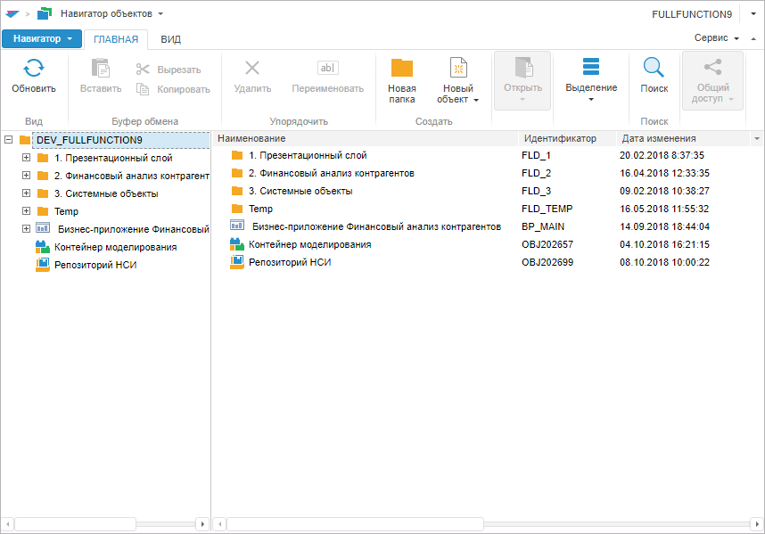

# Пример создания компонента Navigator

Пример создания компонента Navigator
-

# Пример создания компонента Navigator

Для выполнения примера в теге HEAD html-страницы добавьте ссылки на
 следующие js и css-файлы:

	- PP.js;

	- PP.Metabase.js;

	- PP.Navigator.css;

	- PP.Navigator.js;

	- файл с ресурсами (например, resources.ru);

	- PP.css.

В тег BODY добавьте атрибут onload:

<body onload="onLoad();">

</body>

В теге SCRIPT добавьте следующий скрипт:

        // Укажем путь к корневой папке, содержащей файлы ресурсов
        PP.resourceManager.setRootResourcesFolder("../resources/");
        PP.ImagePath = "../build/img/";
        PP.ScriptPath = "../build/";
        // Установим языковые настройки для ресурсов
        PP.setCurrentCulture(PP.Cultures.ru);
        // Создаём соединение с репозиторием
        var mb = new PP.Mb.Metabase({
            PPServiceUrl: "PPService.axd?action=proxy",
            Id: "PREPOSITORY",
            UserCreds: {
                UserName: "user",
                Password: "password"
            }
        });

    var nav;
    function onLoad() {
        //при открытии репозитория:
        mb.open(function () {
            //создаем компонент Navigator

            nav = new PP.Mb.Ui.Navigator({
                Metabase: mb,
                ParentNode: document.body,
                ImagePath: "../build/img/",
            });
            //при открытии объектов в консоль браузера будет выводиться массив объектов,  которые являются источниками события
            nav.OpenObjects.add(function () {
                console.log(arguments);
            });
            //при создании объектов в консоль браузера будет выводиться массив объектов,  которые являются источниками события
            nav.CreateObject.add(function () {
                console.log(arguments);
            });
            //навигатор занимает полностью  пространство контейнера
            nav.fullscreen();
        });
    };

После выполнения примера на html-странице будет размещено окно навигатора
 объектов для указанного репозитория:

При выполнении команд ленты инструментов «Новый
 объект > <Тип объекта>», главного меню «Навигатор
 > Выход» и при открытии объекта в консоль браузера будут выводиться
 массивы тех объектов, которые являются источниками для соответствующих
 событий.

См. также:

[Navigator](Navigator.htm)

		Справочная
		 система на версию 10.9
		 от 18/08/2025,
		 © ООО «ФОРСАЙТ»,
