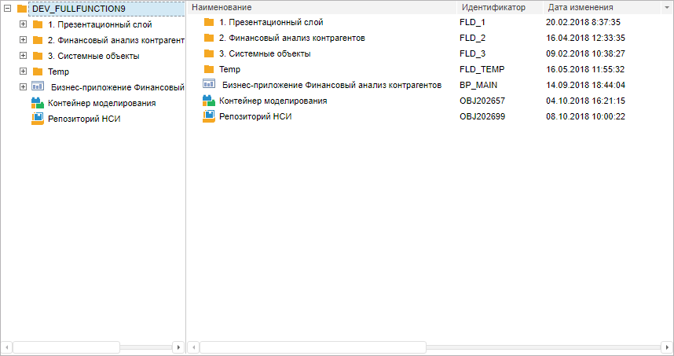

# Пример создания компонента NavigatorBox

Пример создания компонента NavigatorBox
-

# Пример создания компонента NavigatorBox

Для выполнения примера в теге HEAD html-страницы добавьте ссылки на
 следующие js и css-файлы:

	- PP.js;

	- PP.Metabase.js;

	- PP.Navigator.css;

	- PP.Navigator.js;

	- файл с ресурсами (например, resources.ru);

	- PP.css.

В теге SCRIPT добавьте следующий скрипт:

        var navbox;
        function onLoad()
        {
            PP.resourceManager.setRootResourcesFolder("Scripts/resources/");
            PP.setCurrentCulture(PP.Cultures.ru);
            mb = new PP.Mb.Metabase(
            {
                PPServiceUrl: "PPService.axd?action=proxy",
                Id: "WAREHOUSE",
                UserCreds: {
                    UserName: "user",
                    Password: "password"
                }
            });

            mb.open();
            navbox = new PP.Mb.Ui.NavigatorBox(
            {
                Metabase: mb,
                ParentNode: document.getElementById("div1"),
                Width: 700,
                Height: 400,
                //Включена возможность множественного выбора в списке объектов
                ObjectListMultiSelect: true,
                //Путь к папке с картинками
                ImagePath: "PP_img/",
                //При вызове контекстного меню для элемента из дерева папок, будет выдаваться сообщение с ключом выделенной папки
                FolderTreeContextMenu: function (sender, args)
                {

                    alert(navbox.getSelectedFolderTreeObject()[0].getKey())
                },
                //установлен фильтр для контейнерных объектов: в дереве папок будут отображаться только папки
                FolderTreeFilter: [0],
                //в названии объекта будет  его имя и идентификатор
                ObjectListDisplayMode: PP.Mb.Ui.MetabaseDisplayMode.Both,
                //в списке объектов отбражаются объекты следующих типов: стандартные кубы, рабочие книги, экспресс-отчеты и регламентные отчеты
                ObjectListFilters: [1281, 2827, 2561, 2562],
                //скрыто меню для столбцов, то есть нет возможности скрывать столбцы
                HideObjectListColumnsMenu: true,

                //при загрузке списка объектов будут выравниваться столбцы по ширине содержимого
                ObjectListObjectsLoaded: function (sender, args)
                {
                    navbox.adjustColumnsWidthByContent()
                },
                ObjectListSelectionChanged: function (sender, args)
                {
                     console.debug("Выделение элементов изменено")
                 }
            });
        }

В теге BODY добавьте:

<body
 onload="onLoad();">

   

</body>

После выполнения примера на Html-странице будет размещен компонент NavigatorBox:

См. также:

[NavigatorBox](NavigatorBox.htm)

		Справочная
		 система на версию 10.9
		 от 18/08/2025,
		 © ООО «ФОРСАЙТ»,
