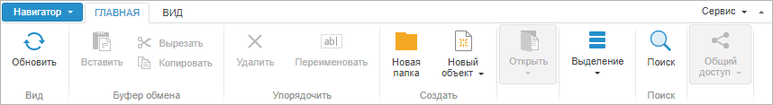

# Пример создания компонента NavigatorRibbon

Пример создания компонента NavigatorRibbon
-

# Пример создания компонента NavigatorRibbon

Для выполнения примера в теге HEAD html-страницы добавьте ссылки на
 следующие js и css-файлы:

	- PP.js;

	- PP.Metabase.js;

	- PP.Navigator.css;

	- PP.Navigator.js;

	- файл с ресурсами (например, resources.ru);

	- PP.css.

В теге SCRIPT добавьте следующий скрипт:

   function onLoad()
   {
       PP.resourceManager.setRootResourcesFolder("Scripts/resources/");
       PP.setCurrentCulture(PP.Cultures.ru);
       mb = new PP.Mb.Metabase(
       {
           ExportUrl: "PPService.axd?action=export",
           ImportUrl: "PPService.axd?action=import",
           PPServiceUrl: "PPService.axd?action=proxy",
           Id: "WAREHOUSE",
           UserCreds: {
               UserName: "user",
               Password: "password"
           }
       });
       mb.open();
       ribbon = new PP.Mb.Ui.NavigatorRibbon(
       {
           //путь к папке с картинками
           ImagePath: "PP_img/navigator/ribbon/",
           ParentNode: document.body,
           //при выборе пункта «Выход» главного меню «Навигатор»
           Exited: function ()
           {
               console.log("Exited")
           },
       });
       //возвращаем все элементы управления на вкладке «Открыть»
       controls = ribbon.getControl().getItems()[0].getPanels()[4].getControls();
       //делаем активными все элементы управления на вкладке «Буфер обмена»
       for (var i = 0; i < controls.length; i++)
       {
           controls[i].setEnabled(true)
       }
       //кнопка «Дерево объектов» не нажата
       ribbon.setShowNavigationPanel(false);
       //Нажата кнопка «Обычные значки»
       ribbon.setObjectListMode("Large");
       //Кнопка «Вставить» активна
       ribbon.setPasteButtonEnabled(true);
       //ribbon.setViewEditButtonsStateByClass(true)
       //добавляем на ленту новую панель:
       ribbon.getControl().getItems()[0].addPanel(new PP.Ui.RibbonPanel(
       {
           Caption: "Новая панель",
           Id: "myPanel"
       }))
       //добавляем кнопку на новую панель
       ribbon.getControlById("myPanel").addControl(new PP.Ui.RibbonButton(
       {
           Content: "Новая кнопка",
           Id: "myButton"
       }))
    // Обновим компонент
    ribbon.refresh();
   }

В теге BODY добавляем атрибут onload:

<body
 onload="onLoad();">

</body>

После выполнения примера на html-странице будет размещен компонент [NavigatorRibbon](NavigatorRibbon.htm), имеющий следующий
 вид:

При нажатии на кнопки ленты в консоли браузера будут появляться сообщения
 с названиями событий, которые генерируются при нажатии на элемент управления.
 На вкладку «Главная» добавлены
 новая панель и новая кнопка.

См. также:

[NavigatorRibbon](NavigatorRibbon.htm)

		Справочная
		 система на версию 10.9
		 от 18/08/2025,
		 © ООО «ФОРСАЙТ»,
