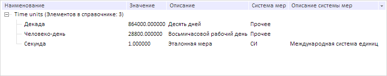

# Attribute.LookUpKey

Attribute.LookUpKey
-

# Attribute.LookUpKey

## Синтаксис

LookUpKey: Number;

## Описание

Свойство LookUpKey определяет ключ связи атрибута справочника с атрибутом другого справочника НСИ.

## Комментарии

Значение свойства устанавливается из JSON и с помощью метода setLookUpKey, а возвращается - с помощью метода getLookUpKey.

## Пример

Для выполнения примера необходимо наличие на странице компонента [DictionaryBox](../../../Components/Rds/DictionaryBox/DictionaryBox.htm) с наименованием «dictionaryBox» (см. «[Пример создания компонента DictionaryBox](../../../Components/Rds/DictionaryBox/DictionaryBox_Example.htm)» ). Отобразим в справочнике НСИ заимствованный атрибут с идентификатором «UNITS_SYSTEM_DESCRIPTION» и определим ключ атрибута, с которым он связан:

// Получим справочник НСИ
var source = dictionaryBox.getSource()[0];
// Получим заимствованный атрибут
var lookUpAttribute = source.getAttribute(null, "UNITS_SYSTEM_DESCRIPTION");
// Отобразим его
var attrs = source.getAttributes();
for (var i in attrs) {
    if (attrs[i].getKey() == lookUpAttribute.getKey()) {
        attrs[i].setVisible(true);
    };
};
console.log("Ключ атрибута по связи для заимствованного атрибута: %s", lookUpAttribute.getLookUpKey());
// Обновим дерево элементов справочника
dictionaryBox.getDataArea().getActiveDictTree().refreshAll();

В результате выполнения примера в справочнике был отображён заимствованный атрибут с идентификатором «UNITS_SYSTEM_DESCRIPTION»:

В консоли браузера был выведен ключ атрибута по связи для заимствованного атрибута:

Ключ атрибута по связи для заимствованного атрибута: 2174

См. также:

[Attribute](Attribute.htm)

		Справочная
		 система на версию 10.9
		 от 18/08/2025,
		 © ООО «ФОРСАЙТ»,
