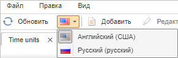
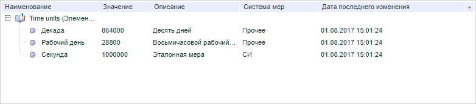
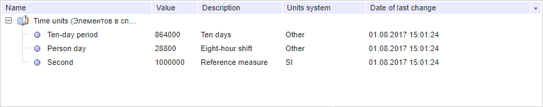

# Attribute.Translation

Attribute.Translation
-

# Attribute.Translation

## Синтаксис

Translation: [PP.Rds.Attribute](Attribute.htm);

## Описание

Свойство Translation определяет
 специальный атрибут для перевода наименования атрибута.

## Комментарии

Значение свойства устанавливается с помощью метода setTranslation,
 а возвращается методом getTranslation.
 Из JSON значение задать нельзя.

Метод setTranslation имеет два
 атрибута: lcid - код языка, attr - атрибут для перевода.

При вызове метода getTranslation
 используется атрибут lcid.

## Пример

Для выполнения примера:

	- Создайте компонент
	 [DictionaryBox](../../../Components/Rds/DictionaryBox/DictionaryBox.htm)
	 с наименованием «dictionaryBox» (см. «[Пример
	 создания компонента DictionaryBox](../../../Components/Rds/DictionaryBox/DictionaryBox_Example.htm)»).

	- Добавьте [перевод](UiNav.chm::/Multilanguage/UiRds_Locale.htm)
	 на английский язык в справочнике НСИ с наименованием «Time units»,
	 который создавался на русском языке.

	- Смените язык в компоненте [DictionaryBox](../../../Components/Rds/DictionaryBox/DictionaryBox.htm)
	 с русского на английский:

	

	- Выполните пример
	 на странице описания [конструктора
	 Attribute](Constructor_Attribute.htm).

	- Выполните пример
	 на странице описания метода [Attribute.parseFromMd](Attribute.parseFromMd.htm).

	- Смените язык
	 с английского на русский. После смены языка появится новый атрибут
	 «Дата последнего изменения» с ключом 1805:

	

	- Выполните в
	 консоли браузера код:

// Получим перевод по умолчанию
var translation = {
    id: PP.Cultures.en.CultureName,
    isDefault: false,
    k: PP.Cultures.en.LCID,
    locale: PP.Cultures.en.LCID
}
// Добавим созданный перевод в список доступных
source.setTranslation(translation);
// Укажем атрибут для перевода
attribute.setTranslation(translation.k, newAttr);
// Установим ключ главного атрибута
newAttr.setMasterAttrKey(attribute.getKey());
// Установим перевод для наименования атрибута
attribute.setTranslatedName(translation.k, attribute.getTranslation(translation.k).getName());
source._AttrsById[newAttr.getId()] = source._AttrsByKey[newAttr.getMasterAttrKey()] = attribute;
// Получим дерево элементов справочника
var tree = dictionaryBox.getDataArea().getActiveDictTree();
// Получим региональные настройки справочника по умолчанию
var defaultLocale = source.getDefaultTranslation();
console.log("Код региональных настроек по умолчанию: %s, идентификатор: " + defaultLocale.k, defaultLocale.id);
// Обработаем событие ElementsLocaleChanged
tree.ElementsLocaleChanged.add(function (sender, args) {
    console.log("Код предыдущего языка: %s", args.OldLocale);
    console.log("Код текущего языка: %s", args.NewLocale);
});
tree.setElementsLocale(translation.k);
// Обновим дерево элементов справочника
tree.refreshAll();
В результате выполнения примера наименования всех атрибутов были переведены
 с русского языка на английский:

В консоли браузера был выведен код текущего и предыдущего языка, а также
 код и идентификатор региональных настроек по умолчанию:

Код региональных настроек по умолчанию: ru_RU, идентификатор:
 1049

Код предыдущего языка: 1049

Код текущего языка: 1033

См. также:

[Attribute](Attribute.htm)

		Справочная
		 система на версию 10.9
		 от 18/08/2025,
		 © ООО «ФОРСАЙТ»,
