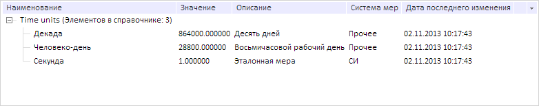

# Конструктор Attribute

Конструктор Attribute
-

# Конструктор Attribute

## Синтаксис

PP.Rds.Attribute(settings: Object);

## Параметры

settings. Настройки атрибута.

## Описание

Конструктор Attribute создаёт
 экземпляр объекта атрибута справочника НСИ.

## Пример

Для выполнения примера необходимо наличие на странице компонента [DictionaryBox](../../../Components/Rds/DictionaryBox/DictionaryBox.htm)
 с наименованием «dictionaryBox» (см. «[Пример
 создания компонента DictionaryBox](../../../Components/Rds/DictionaryBox/DictionaryBox_Example.htm)» ). Создадим атрибут, добавим его
 в справочник НСИ и установим для всех дочерних элементов значение атрибута
 по умолчанию:

// Получим справочник НСИ
var source = dictionaryBox.getSource()[0];
// Создадим атрибут
var attribute = new PP.Rds.Attribute({
    Id: "LastEditingDate",
    Key: 1805, // Ключ атрибута
    ArgKey: 7, // Ключ аргумента управляющего значением атрибута
    HasMultipleValues: true, // Разрешим принимать несколько значений
    IsTranslation: false, // Перевод отсутствует
    IsMultilingual: false, // Не является мультиязычным
    Nullable: false, // Не может принимать пустые значения
    Kind: PP.Rds.AttributeKind.Calculated, // Вид атрибута
    Type: PP.Mb.DbDataType.DateTime, // Тип
    Owner: source, // Справочник, к которому принадлежит атрибут
    VisibleForEdit: 2, // Доступен для редактирования, если не скрытый
    Visible: true, // Видимый атрибут
    Predefined: PP.Rds.PredefinedAttribute.InDate, // Атрибут предопределён
    Name: "Дата последнего изменения", // Наименование атрибута
    Tag: "Атрибут для хранения даты последнего изменения", // Пользовательская информация
    ReadAccess: "1", // Разрешим только чтение пользователю «ADMIN»
    WriteAccess: "2", // Разрешим запись пользователю «Администраторы»
    TimeDependent: true // Будем также отображать время
});
// Установим созданный атрибут для справочника НСИ
var atrMd = attribute.getSettings();
atrMd.n = attribute.getName();
source.setAttribute(atrMd);
// Добавим созданный атрибут в метаданные
var metadata = source.getMetadata();
var attrsArr = PP.getProperty(metadata, "attrs.its.it");
attrsArr.push(atrMd);
// Получим дочерние элементы справочника
var childEls = source.getChildEls();
// Для атрибута всех элементов укажем значение по умолчанию
for (var i = 0; i < childEls.length; i++) {
    childEls[i]._initAttrValues();
    childEls[i].setValue("LastEditingDate", attribute.getDefaultValue());
};
// Обновим дерево элементов справочника
dictionaryBox.getDataArea().getActiveDictTree().refreshAll();
В результате выполнения примера был создан и отображён в справочнике
 атрибут с ключом 1805 и с наименованием «Дата последнего изменения». Для
 всех дочерних элементов было установлено значение атрибута по умолчанию:

См. также:

[Attribute](Attribute.htm)

		Справочная
		 система на версию 10.9
		 от 18/08/2025,
		 © ООО «ФОРСАЙТ»,
