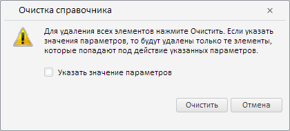

# Конструктор CleanUpDialog

Конструктор CleanUpDialog
-

# Конструктор CleanUpDialog

## Синтаксис

PP.Rds.Ui.CleanUpDialog(settings: Object);

## Параметры

settings. Настройки класса.

## Описание

Конструктор CleanUpDialog создаёт диалог для очистки справочника НСИ.

## Пример

Для выполнения примера необходимо наличие на странице компонента [DictionaryBox](../../../Components/Rds/DictionaryBox/DictionaryBox.htm) с наименованием «dictionaryBox» (см. «[Пример создания компонента DictionaryBox](../../../Components/Rds/DictionaryBox/DictionaryBox_Example.htm)» ). Создадим диалог для очистки справочника НСИ, обработаем события [CleanCanceled](CleanUpDialog.CleanCanceled.htm) и [CleanConfirmed](CleanUpDialog.CleanConfirmed.htm):

// Создадим диалог для очистки справочника
var cleanUpDialog = new PP.Rds.Ui.CleanUpDialog({
    Source: dictionaryBox.getSource()[0],
    ImagePath: PP.ImagePath,
    CleanCanceled: function (sender, args) {
        // Уничтожим данный диалог
        sender.dispose();
    },
    CleanConfirmed: function (sender, args) {
        // Получим дерево элементов справочника
        var tree = dictionaryBox.getDataArea().getActiveDictTree();
        if (tree) {
            // Очистим дерево
            tree.cleanUpDict(args.Params);
            // Удалим данный диалог
            sender.dispose();
        }
    }
});
// Отобразим данный диалог
cleanUpDialog.showDialog();

В результате выполнения примера был создан диалог для очистки справочника НСИ:

После нажатия на кнопку «Очистить» в результате срабатывания обработчика события [CleanConfirmed](CleanUpDialog.CleanConfirmed.htm) будут удалены все элементы дерева справочника НСИ кроме корневого «Time units»:

При нажатии на кнопку «Отмена» будет вызвано событие [CleanCanceled](CleanUpDialog.CleanCanceled.htm), обработчик которого удалит данный диалог.

См. также:

[CleanUpDialog](CleanUpDialog.htm)

		Справочная
		 система на версию 10.9
		 от 18/08/2025,
		 © ООО «ФОРСАЙТ»,
