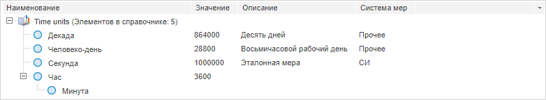

# Конструктор DItem

Конструктор DItem
-

# Конструктор DItem

## Синтаксис

PP.Rds.DItem(settings);

## Параметры

settings. JSON-объект со значениями
 свойств класса.

## Описание

Конструктор DItem создаёт экземпляр
 класса [DItem](DItem.htm).

## Пример

Для выполнения примера необходимо наличие на странице компонента [RdsBox](../../../Components/Rds/DictionaryBox/DictionaryBox.htm)
 с наименованием «rdsBox» (см. «[Пример
 создания компонента DictionaryBox](../../../Components/Rds/DictionaryBox/DictionaryBox_Example.htm)» ). Создадим в справочнике НСИ два
 элемента, второй из которых вложен в первый. Для первого элемента укажем
 значение:

// Создадим новый элемент с ключом 1711
var hourItemKey = "1711";
var hourItem = new PP.Dictionaries.DItem({
    Key: hourItemKey,
    AttrValues: [hourItemKey, "Час"], // Значения атрибутов
    HasChild: true, // Элемент имеет потомков
    Name: "Час",
    Owner: source,
    Level: 0, // Уровень элемента в дереве
});
// Создадим второй элемент через вспомогательную функцию getBlankElement
var minuteItemKey = "1712";
var minuteItem = source.getBlankElement(minuteItemKey);
minuteItem.setAttrValues([minuteItemKey, "Минута"]);
minuteItem.setName("Минута");
minuteItem.setLevel(1);
minuteItem.setHasChild(false);
// Получим список атрибутов
var attributes = source.getAttributes().map((attr) => { return { id: attr.getId() } });
// Добавим первый элемент
service.setItem(source, PP.Dictionaries.ElementOperation.Insert, "", attributes, hourItem, function () {
    // Добавим второй элемент
    service.setItem(source, PP.Dictionaries.ElementOperation.Insert, hourItemKey, attributes, minuteItem, function () {
        // Обновим дерево элементов справочника
        rdsBox.getDataArea().getActiveDictTree().resetDictionary();
    });
});

В результате выполнения примера будут добавлены два элемента. Второй
 элемент «Минута» с ключом 1712 вложен в элемент «Час» с ключом 1711.
 Для первого элемента установлено значение 3600:

См. также:

[DItem](DItem.htm)

		Справочная
		 система на версию 10.9
		 от 18/08/2025,
		 © ООО «ФОРСАЙТ»,
