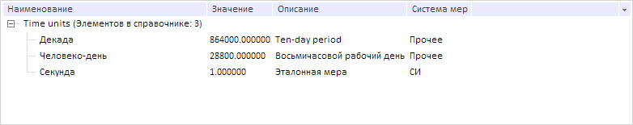

# DItem.ValueTranslation

DItem.ValueTranslation
-

# DItem.ValueTranslation

## Синтаксис

ValueTranslation: String;

## Описание

Свойство ValueTranslation определяет текст перевода значения атрибута элемента справочника НСИ.

## Комментарии

Значение свойства устанавливается с помощью метода setValueTranslation, а возвращается - с помощью метода getValueTranslation. Из JSON значение задать нельзя.

Метод setValueTranslation имеет три параметра: attrId - идентификатор атрибута, lcid - код языка, value - значение атрибута.

При вызове метода getValueTranslation указываются следующие параметры: attrId, lcid, linkedVal - признак того, что будет возвращена ссылка на значение.

Если перевод для атрибута не найден, то данное свойство аналогично свойству [DItem.Value](DItem.Value.htm).

## Пример

Для выполнения примера необходимо наличие на странице компонента [DictionaryBox](../../../Components/Rds/DictionaryBox/DictionaryBox.htm) с наименованием «dictionaryBox» (см. «[Пример создания компонента DictionaryBox](../../../Components/Rds/DictionaryBox/DictionaryBox_Example.htm)» ). Установим для первого дочернего элемента справочника НСИ локализованный перевод значения по атрибуту «DESCRIPTION»:

// Получим справочник НСИ
var source = dictionaryBox.getSource()[0];
// Получим сервис для работы со справочником
var service = source.getPPService();
// Получим дочерние элементы справочника
var childEls = source.getChildEls();
// Установим перевод значения атрибута «DESCRIPTION»
childEls[0].setValueTranslation("DESCRIPTION", PP.Cultures.en.LCID, "Ten-day period");
// Обновим дерево элементов справочника
dictionaryBox.getDataArea().getActiveDictTree().refreshAll();

В результате выполнения примера для первого дочернего элемента справочника НСИ был установлен локализованный перевод значения по атрибуту «DESCRIPTION»:

См. также:

[DItem](DItem.htm)

		Справочная
		 система на версию 10.9
		 от 18/08/2025,
		 © ООО «ФОРСАЙТ»,
