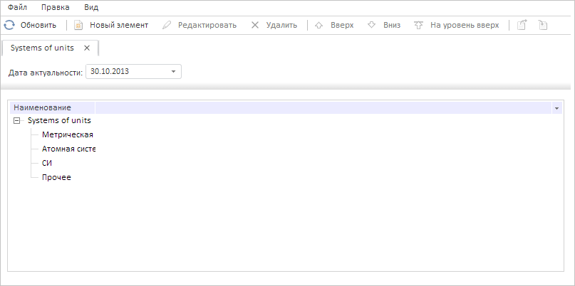

# DataArea.addItem

DataArea.addItem
-

# DataArea.addItem

## Синтаксис

addItem(source: [PP.Rds.Dictionary](../Dictionary/Dictionary.htm),
 settings: Object, setActive: Boolean, replace: Boolean);

## Параметры

source. Загружаемый справочник
 НСИ;

settings. Настройки для элементов
 управления справочника. Если не заданы, то используются настройки по умолчанию;

setActive. Признак того, будет
 ли добавленный справочник активным. Если параметр равен значению true, то справочник будет активным,
 иначе - неактивным (по умолчанию);

replace. Признак замены справочника,
 имеющего такой же ключ. Если параметр равен значению true,
 то справочник НСИ с таким же ключом будет заменён на указанный, иначе
 - не будет (по умолчанию).

## Описание

Метод addItem добавляет вкладку
 с указанным справочником НСИ, либо обновляет справочник с таким же ключом
 на существующей вкладке.

## Комментарии

Метод возвращает значение true
 в случае добавления новой вкладки; замещённый объект типа [PP.Rds.Dictionary](../Dictionary/Dictionary.htm)
 в случае обновления справочника НСИ; значение false,
 если ничего не сделано.

## Пример

Для выполнения примера необходимо наличие на странице компонента [DictionaryBox](../../../Components/Rds/DictionaryBox/DictionaryBox.htm)
 с наименованием «dictionaryBox» (см. «[Пример
 создания компонента DictionaryBox](../../../Components/Rds/DictionaryBox/DictionaryBox_Example.htm)» ). Очистим все открытые справочники
 НСИ, а затем добавим в область данных контейнера справочник с ключом 8096.
 Также обработаем событие [ActiveTabChanged](DataArea.ActiveTabChanged.htm)
 и скроем панель истории значений атрибутов, если она отображается, и наоборот
 - покажем её, если она скрыта:

// Получим справочник НСИ
var source = dictionaryBox.getSource()[0];
// Получим сервис для работы со справочником
var service = source.getPPService();
// Получим область данных справочника
var dataArea = dictionaryBox.getDataArea();
// Очистим все открытые справочники
dataArea.clear();
// Обработаем событие ActiveTabChanged
dataArea.ActiveTabChanged.add(function (sender, args) {
    console.log("Текущим стал другой справочник НСИ");
});
// Зададим ключ справочника
var key = 8096;
// Откроем справочник НСИ с ключом 8096
var dimenstionsSource = service.openRds(key, null);
// Добавим открытый справочник в область данных
dataArea.addItem(dimenstionsSource, null, true, true, false);
// Уберём панель с историей значений атрибутов
if (dataArea.getIsHistoryCollapsed(key)) {
    dataArea.expandHistory(key);
} else {
    dataArea.collapseHistory(key);
};
В результате выполнения примера все загруженные справочники НСИ были
 очищены и добавлен справочник с ключом 8096. Панель истории значений атрибута
 скрыта:

В консоли браузера были выведены ключ и идентификатор открытого справочника
 НСИ, а также в следствие срабатывания обработчика события [ActiveTabChanged](DataArea.ActiveTabChanged.htm)
 уведомление об изменении текущего справочника НСИ:

Ключ открытого справочника: 8096

Идентификатор открытого справочника: UNITS_SYSTEMS

Текущим стал другой справочник НСИ

См. также:

[DataArea](DataArea.htm)

		Справочная
		 система на версию 10.9
		 от 18/08/2025,
		 © ООО «ФОРСАЙТ»,
