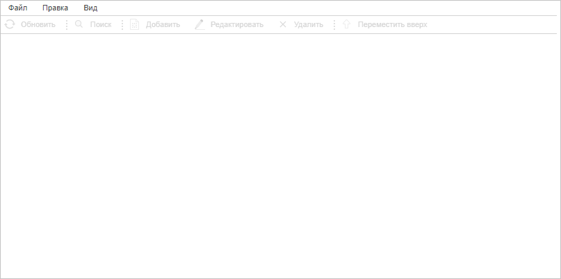

# DataArea.deleteItemByKey

DataArea.deleteItemByKey
-

# DataArea.deleteItemByKey

## Синтаксис

deleteItemByKey(key: String, withDispose: Boolean);

## Параметры

key. Ключ справочника, вкладку с которым нужно удалить;

withDispose. Признак удаления элементов управления в области данных контейнера. Если параметр равен значению true (по умолчанию), то элементы управления будут уничтожены, иначе - не будут.

## Описание

Метод deleteItemByKey удаляет вкладку по указанному ключу справочника НСИ, который в ней лежит.

## Пример

Для выполнения примера необходимо наличие на странице компонента [DictionaryBox](../../../Components/Rds/DictionaryBox/DictionaryBox.htm) с наименованием «dictionaryBox» (см. «[Пример создания компонента DictionaryBox](../../../Components/Rds/DictionaryBox/DictionaryBox_Example.htm)» ). Удалим текущую вкладку в области данных контейнера:

// Получим область данных справочника
var dataArea = dictionaryBox.getDataArea();
// Получим ключ первого открытого справочника
var key = dictionaryBox.getSource()[0].getKey();
// Удалим текущую вкладку со справочником
dataArea.deleteItemByKey(key);

В результате выполнения примера была удалена текущая вкладка в области данных контейнера:

См. также:

[DataArea](DataArea.htm)

		Справочная
		 система на версию 10.9
		 от 18/08/2025,
		 © ООО «ФОРСАЙТ»,
