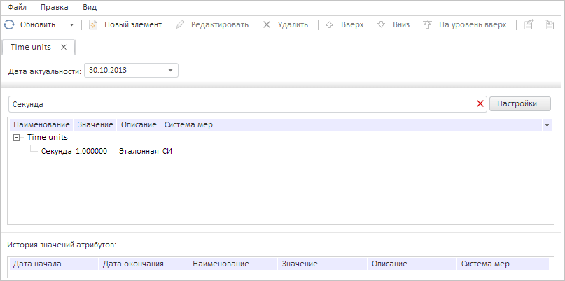
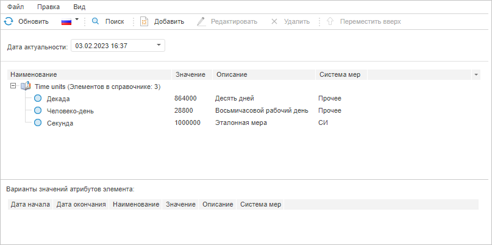

# DataArea.getActiveFindBox

DataArea.getActiveFindBox
-

# DataArea.getActiveFindBox

## Синтаксис

getActiveFindBox();

## Описание

Метод getActiveFindBox возвращает контейнер для поиска элементов справочника НСИ на активной вкладке.

## Комментарии

Метод возвращает объект типа [PP.Rds.Ui.FindBox](../FindBox/FindBox.htm).

## Пример

Для выполнения примера необходимо наличие на странице компонента [DictionaryBox](../../../Components/Rds/DictionaryBox/DictionaryBox.htm) с наименованием «dictionaryBox» (см. «[Пример создания компонента DictionaryBox](../../../Components/Rds/DictionaryBox/DictionaryBox_Example.htm)» ). Отобразим контейнер для поиска элементов справочника НСИ, выведем количество дочерних элементов его источника данных, отфильтруем их по строке «Секунда» и обработаем событие [ActiveTreeEdited](DataArea.ActiveTreeEdited.htm):

// Получим область данных справочника
var dataArea = dictionaryBox.getDataArea();
// Получим активный контейнер для поиска элементов справочника
var findBox = dataArea.getActiveFindBox();
// Отобразим его
dataArea.showFindBox();
// Выведем количество элементов источника данных контейнера поиска
console.log("Количество элементов источника данных контейнера поиска: " +
    findBox.getSource().getChildEls().length);
// Обработаем событие FindChanged
findBox.FindChanged.add(function (sender, args) {
    console.log("Текст фильтра: %s", args.Filter.text);
});
// Обработаем событие ActiveTreeEdited
dataArea.ActiveTreeEdited.add(function (sender, args) {
    console.log("Представление текущего справочника было изменено");
});
// Получим настройки поиска
var filterSettings = findBox.getFilterSettings();
// Отфильтруем элементы по тексту «Секунда»
filterSettings.text = "Секунда";
findBox.setFilterSettings(filterSettings, true);
// Получим строку поиска
var findTextBox = findBox._FindTextBox;
// Установим текст в данной строке
findTextBox.setContent(filterSettings.text);
// Применим фильтр
findTextBox.Enter.fire(findTextBox);

В результате выполнения примера был отображён контейнер для поиска элементов справочника НСИ, в консоли браузера было выведено количество дочерних элементов его источника данных, элементы данного справочника были отфильтрованы по строке «Секунда»:

В консоли браузера после срабатывания обработчика события [ActiveTreeEdited](DataArea.ActiveTreeEdited.htm) было выведено сообщение о том, что представление текущего справочника было изменено.

Теперь скроем контейнер для поиска элементов справочника НСИ:

dataArea.hideFindBox();

После выполнения указанной строки сценарий данный контейнер будет скрыт, а применённый фильтр будет сброшен:

В консоли браузера будет выведено то же сообщение.

См. также:

[DataArea](DataArea.htm)

		Справочная
		 система на версию 10.9
		 от 18/08/2025,
		 © ООО «ФОРСАЙТ»,
