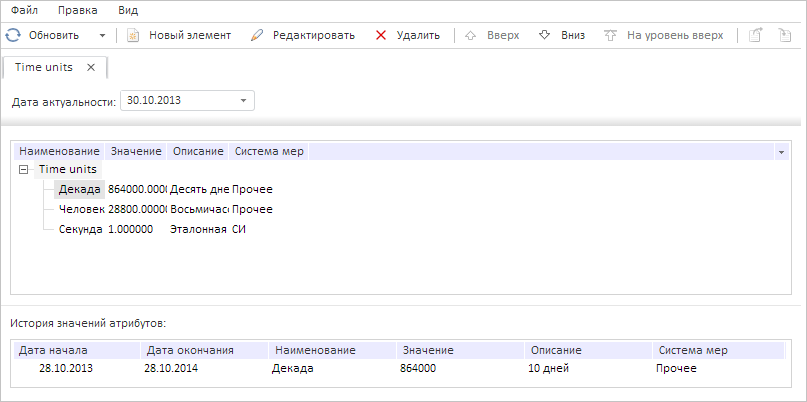

# DataArea.getActiveHistoryBox

DataArea.getActiveHistoryBox
-

# DataArea.getActiveHistoryBox

## Синтаксис

getActiveHistoryBox();

## Описание

Метод getActiveHistoryBox возвращает
 дерево c историей значений атрибутов справочника НСИ на активной вкладке.

## Комментарии

Метод возвращает значение типа [PP.Ui.TreeList](dhtmlUiTree.chm::/Classes/TreeList/TreeList.htm).

## Пример

Для выполнения примера необходимо наличие на странице компонента [DictionaryBox](../../../Components/Rds/DictionaryBox/DictionaryBox.htm)
 с наименованием «dictionaryBox» (см. «[Пример
 создания компонента DictionaryBox](../../../Components/Rds/DictionaryBox/DictionaryBox_Example.htm)» ). Выделим в дереве элементов активного
 справочника НСИ первый элемент, для дерева с историей значений атрибутов
 загрузим собственные данные и обработаем событие [ActiveTreeSelectionChanged](DataArea.ActiveTreeSelectionChanged.htm):

// Получим справочник НСИ
var source = dictionaryBox.getSource()[0];
// Получим область данных справочника
var dataArea = dictionaryBox.getDataArea();
// Получим контейнер для отображения истории значений атрибутов
var historyBox = dataArea.getActiveHistoryBox();
// Получим дерево элементов справочника
var tree = dictionaryBox.getDataArea().getItemByKey(source.getKey()).DictTree;
// Получим первый элемент дерева
var el = source.getChildEls()[0];
// Обработаем событие ActiveTreeEdited
dataArea.ActiveTreeSelectionChanged.add(function (sender, args) {
    console.log("Выделен другой элемент текущего справочника НСИ");
});
tree._Tree.getNodeByKey(el.getKey()).setSelected(true, true, true);
// Сформируем данные для данного контейнера
var json = [{
    Columns: ["28.10.2014", "Декада", "864000", "10 дней", "Прочее"],
    Key: el.getKey(),
    Text: "28.10.2013"
}];
// Загрузим новые значения
historyBox.getNodes().loadFrom(json);
В результате выполнения примера в дереве элементов активного справочника
 НСИ был выделен элемент «Декада», а в дереве с историей значений атрибутов
 стали отображаться собственные данные:

В консоли браузера после срабатывания обработчика события [DictionaryBox](../../../Components/Rds/DictionaryBox/DictionaryBox.htm)
 было выведено уведомление о том, что выделен другой элемент текущего справочника
 НСИ.

См. также:

[DataArea](DataArea.htm)

		Справочная
		 система на версию 10.9
		 от 18/08/2025,
		 © ООО «ФОРСАЙТ»,
