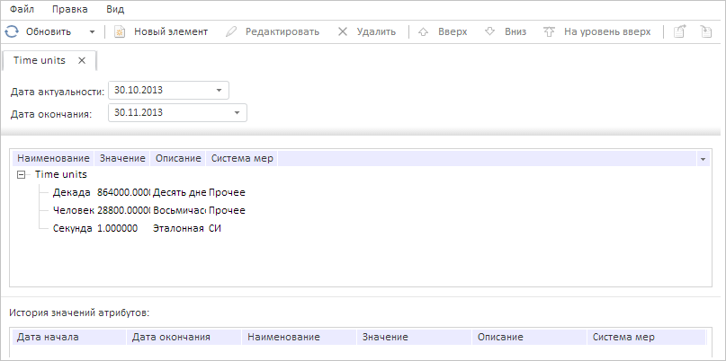

# DataArea.getActiveParamBox

DataArea.getActiveParamBox
-

# DataArea.getActiveParamBox

## Синтаксис

getActiveParamBox();

## Описание

Метод getActiveParamBox возвращает контейнер для параметров справочника НСИ на активной вкладке.

## Комментарии

Метод возвращает значение типа [PP.Rds.Ui.ParamsBox](../ParamsBox/ParamsBox.htm).

## Пример

Для выполнения примера необходимо наличие на странице компонента [DictionaryBox](../../../Components/Rds/DictionaryBox/DictionaryBox.htm) с наименованием «dictionaryBox» (см. «[Пример создания компонента DictionaryBox](../../../Components/Rds/DictionaryBox/DictionaryBox_Example.htm)» ). В настройках справочника «Time units» должен быть включён флажок для пункта «Элементы могут изменяться во времени».

Добавим в контейнер для параметров справочника НСИ новый параметр с пользовательскими настройками:

// Получим справочник НСИ
var source = dictionaryBox.getSource()[0];
// Получим область данных справочника
var dataArea = dictionaryBox.getDataArea();
// Зададим настройки для нового параметра
var argMd = {
    k: 8209, // Ключ параметра
    id: "ENDDATE",
    dt: PP.Mb.DbDataType.DateTime,
    n: "Дата окончания",
    binding: "UI='DateTimePicker'",
    vis: true,
    value: null,
    attribute: {
        k: source.getAttribute(null, "OUTDATE").getKey() // Свяжем параметр с атрибутом «OUTDATE»
    }
};
// Установим данный параметр для справочника
source.setOpenArg(argMd);
source.setParameter(argMd);
var res = PP.getProperty(source.getMetadata(), "params.its.it");
res.push(argMd);
// Получим контейнер с параметрами
var paramsBox = dataArea.getActiveParamBox();
// Обновим контейнер с параметрами
paramsBox.refreshAll();

В результате выполнения примера в контейнер для параметров справочника НСИ был добавлен новый параметр «ENDDATE» с ключом 8209:

См. также:

[DataArea](DataArea.htm)

		Справочная
		 система на версию 10.9
		 от 18/08/2025,
		 © ООО «ФОРСАЙТ»,
