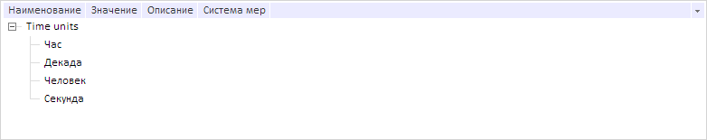

# Dictionary.ShowHidden

Dictionary.ShowHidden
-

# Dictionary.ShowHidden

## Синтаксис

ShowHidden: Boolean;

## Описание

Свойство ShowHidden определяет, требуется ли отобразить в справочнике НСИ скрытые элементы.

## Комментарии

Значение свойства устанавливается с помощью метода setShowHidden, а возвращается - с помощью метода getShowHidden. Из JSON значение задать нельзя.

Свойство содержит значение true, если в справочнике требуется отобразить скрытие элементы, иначе - значение false.

## Пример

Для выполнения примера необходимо наличие на странице компонента [DictionaryBox](../../../Components/Rds/DictionaryBox/DictionaryBox.htm) с наименованием «dictionaryBox» (см. «[Пример создания компонента DictionaryBox](../../../Components/Rds/DictionaryBox/DictionaryBox_Example.htm)» ). Отобразим в справочнике скрытые элементы, либо выведем уведомление об их отсутствии:

// Получим справочник НСИ
var source = dictionaryBox.getSource()[0];
// Получим дерево справочника НСИ
var tree = dictionaryBox.getDataArea().getActiveDictTree();
if (source.hasHidden()) {
    // Отобразим скрытые элементы справочника
    tree._ShowHidden = true;
    source.setShowHidden(true);
    // Обновим дерево элементов справочника
    tree.refreshAll(true);
} else {
    console.log("Скрытые элементы отсутствуют в справочнике");
};

В результате выполнения примера в справочнике НСИ был отображен скрытый элемент «Час».

Если скрытые элементы отсутствуют в справочнике, то в консоли браузера будет выведено соответствующее уведомление.

См. также:

[Dictionary](Dictionary.htm)

		Справочная
		 система на версию 10.9
		 от 18/08/2025,
		 © ООО «ФОРСАЙТ»,
