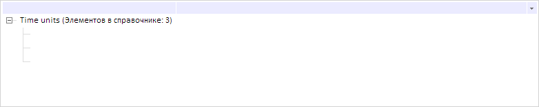

# Dictionary.clearAll

Dictionary.clearAll
-

# Dictionary.clearAll

## Синтаксис

clearAll();

## Описание

Метод clearAll очищает данные справочника НСИ.

## Пример

Для выполнения примера необходимо наличие на странице компонента [DictionaryBox](../../../Components/Rds/DictionaryBox/DictionaryBox.htm) с наименованием «dictionaryBox» (см. «[Пример создания компонента DictionaryBox](../../../Components/Rds/DictionaryBox/DictionaryBox_Example.htm)» ). Очистим данные справочника НСИ:

// Получим справочник НСИ
var source = dictionaryBox.getSource()[0];
// Очистим данные справочника
source.clearAll();
// Определим метаданные
source.setMetadata({
    attrs: {
        its: {
            it: []
        }
    }
});
// Обновим дерево элементов справочника
dictionaryBox.getDataArea().getActiveDictTree().refreshAll();

В результате выполнения примера были очищены данные справочника НСИ:

См. также:

[Dictionary](Dictionary.htm)

		Справочная
		 система на версию 10.9
		 от 18/08/2025,
		 © ООО «ФОРСАЙТ»,
