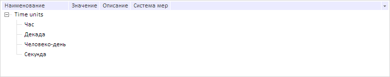

# DictionaryTree.ShowHidden

DictionaryTree.ShowHidden
-

**

# DictionaryTree.ShowHidden

## Синтаксис

ShowHidden: Boolean;

## Описание

Свойство ShowHidden определяет режим отображения скрытых элементов.

## Комментарии

Значение свойства устанавливается из JSON и с помощью метода setShowHidden, а возвращается с помощью метода getShowHidden.**

Если свойство имеет значение true, то скрытые элементы будут отображены, иначе - не будут.

## Пример

Для выполнения примера предполагается наличие на странице компонента [DictionaryBox](../../../Components/Rds/DictionaryBox/DictionaryBox.htm) с наименованием «dictionaryBox» (см. «[Пример создания компонента DictionaryBox](../../../Components/Rds/DictionaryBox/DictionaryBox_Example.htm)» ). Получим дерево элементов справочника и отобразим скрытые элементы:

// Получим область данных справочника
var area = dictionaryBox.getDataArea();
// Получим дерево элементов справочника
var tree = area.getActiveDictTree();
// Отобразим скрытые элементы
tree.setShowHidden(true);

В результате выполнения примера в справочнике НСИ был отображен скрытый элемент «Час».

См. также:

[DictionaryTree](DictionaryTree.htm)

		Справочная
		 система на версию 10.9
		 от 18/08/2025,
		 © ООО «ФОРСАЙТ»,
