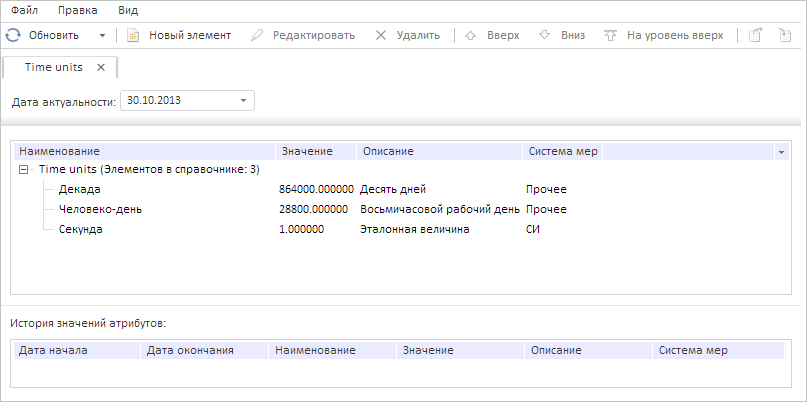

# DictionaryTree.Source

DictionaryTree.Source
-

**

# DictionaryTree.Source

## Синтаксис

Source: [PP.Rds.Dictionary](../Dictionary/Dictionary.htm);

## Описание

Свойство Source определяет источник данных дерева элементов справочника.

## Комментарии

Значение свойства устанавливается из JSON и с помощью метода setSource, а возвращается с помощью метода getSource.**

## Пример

Для выполнения примера предполагается наличие на странице компонента [DictionaryBox](../../../Components/Rds/DictionaryBox/DictionaryBox.htm) с наименованием «dictionaryBox» (см. «[Пример создания компонента DictionaryBox](../../../Components/Rds/DictionaryBox/DictionaryBox_Example.htm)» ). Получим дерево элементов справочника и обработаем событие [Refreshed](DictionaryTree.Refreshed.htm). Выведем имя источника данных дерева и отображаемый атрибут дерева справочника при его наличии, установим оптимальную ширину столбцов дерева, после чего обновим дерево элементов:

// Получим область данных справочника
var area = dictionaryBox.getDataArea();
// Получим дерево элементов справочника
var tree = area.getActiveDictTree();
// Обработаем событие Refreshed
tree.Refreshed.add(function (sender, eventArgs) {
    console.log("Инициировано событие Refreshed");
});
// Получим источник данных
var source = tree.getSource();
// Выведем имя источника данных
console.log("Имя источника данных дерева элементов: " + source.getName());
// Выведем отображаемый атрибут дерева справочника при его наличии
if (tree.getDisplayAttrId() != null) {
    console.log("Отображаемый атрибут дерева справочника: " + tree.getDisplayAttrId());
}
// Установим оптимальную ширину столбцов дерева
tree.adjustColumnWidth()
// Обновим дерево элементов
tree.refresh();

В результате была установлена оптимальная ширина столбцов дерева:

Также в консоли браузера было выведено сообщение о вызове обработанного события, было выведено имя источника данных и имя отображаемого атрибута дерева при его наличии:

Имя источника данных дерева элементов: Time units

Инициировано событие Refreshed

См. также:

[DictionaryTree](DictionaryTree.htm)

		Справочная
		 система на версию 10.9
		 от 18/08/2025,
		 © ООО «ФОРСАЙТ»,
