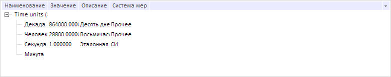

# DictionaryTree.addItem

DictionaryTree.addItem
-

# DictionaryTree.addItem

## Синтаксис

addItem(pKey: Number, dItem: [PP.Rds.DItem](../DItem/DItem.htm))

## Параметры

pKey. Ключ родительского элемента добавляемого элемента. Если параметр не задан, то используется ключ последнего выделенного элемента. Если нет выделенных элементов, то новый элемент добавляется в корень дерева.

dItem. Добавляемый элемент. Если параметр не указан, то будет отображен компонент [ElementCard](../ElementCard/ElementCard.htm) для создания нового элемента.

## Описание

Метод addItem добавляет новый элемент в дерево.

## Пример

Для выполнения примера предполагается наличие на странице компонента [DictionaryBox](../../../Components/Rds/DictionaryBox/DictionaryBox.htm) с наименованием «dictionaryBox» (см. «[Пример создания компонента DictionaryBox](../../../Components/Rds/DictionaryBox/DictionaryBox_Example.htm)» ). Получим дерево элементов справочника и обработаем событие [TreeEdited](DictionaryTree.TreeEdited.htm). Отобразим компонент ElementCard для создания нового элемента:

// Получим область данных справочника
var area = dictionaryBox.getDataArea();
// Получим дерево элементов справочника
var tree = area.getActiveDictTree();
// Обработаем событие TreeEdited
tree.TreeEdited.add(function (sender, eventArgs) {
    console.log("Инициировано событие TreeEdited");
});
// Добавим новый элемент
tree.addItem();

Добавим вручную новый элемент с наименованием «Минута» в дерево.

В результате в дерево был добавлен новый элемент:

Также в консоли браузера было выведено сообщение о вызове обработанного события:

Инициировано событие TreeEdited

См. также:

[DictionaryTree](DictionaryTree.htm)

		Справочная
		 система на версию 10.9
		 от 18/08/2025,
		 © ООО «ФОРСАЙТ»,
