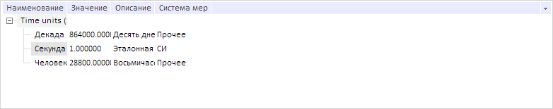
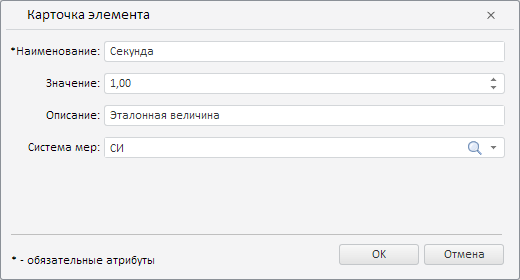

# DictionaryTree.doPredefinedMove

DictionaryTree.doPredefinedMove
-

# DictionaryTree.doPredefinedMove

## Синтаксис

doPredefinedMove(moveOp: [PP.Rds.Ui.TreeOperations](../../../Enums/TreeOperations.htm));

## Параметры

moveOp. Тип операции.

## Описание

Метод doPredefinedMove выполняет указанную операцию над выделенными вершинами дерева.

## Пример

Для выполнения примера предполагается наличие на странице компонента [DictionaryBox](../../../Components/Rds/DictionaryBox/DictionaryBox.htm) с наименованием «dictionaryBox» (см. «[Пример создания компонента DictionaryBox](../../../Components/Rds/DictionaryBox/DictionaryBox_Example.htm)» ). Получим дерево элементов справочника. Выделим элемент дерева и переместим его на одну позицию вверх:

// Получим область данных справочника
var area = dictionaryBox.getDataArea();
// Получим дерево элементов справочника
var tree = area.getActiveDictTree();
// Выделим элемент дерева
tree._Tree.getNodeByIndex(3).setSelected(true);
// Переместим выделенный элемент на одну позицию выше
tree.doPredefinedMove(PP.Rds.Ui.TreeOperations.MoveElementsUp);

В результате выделенный элемент был перемещен на одну позицию вверх:

Откроем карточку выделенного элемента для его редактирования:

tree.editItem();

В результате была открыта карточка выделенного элемента для его редактирования:

См. также:

[DictionaryTree](DictionaryTree.htm)

		Справочная
		 система на версию 10.9
		 от 18/08/2025,
		 © ООО «ФОРСАЙТ»,
